# **Introduction**

AD enumeration is the essential first step in internal penetration tests of Windows enterprise networks. Often we only get VPN access without user credentials, so we must collect domain info (users, groups, computers, policies). That helps reveal vulnerabilities or attack paths that can give an initial foothold (e.g., access to a user workstation).

**Learning Objectives**

In this room you will learn to:

* Enumerate the target domain and network.
* Discover valid domain users and spot misconfigurations.
* Perform password-spraying attacks to obtain initial AD credentials.
* Find sensitive credentials stored in configuration files.

**Room Prerequisites**

Recommended knowledge: Windows & Active Directory, Linux, command line, and networking. Refresh with:

* [Windows and AD Fundamentals](https://tryhackme.com/module/windows-and-active-directory-fundamentals) (including [Active Directory Basics](https://tryhackme.com/room/winadbasics))
* [Linux Fundamentals](https://tryhackme.com/module/linux-fundamentals)
* [Command Line](https://tryhackme.com/module/command-line)
* [Networking](https://tryhackme.com/module/networking)

**Starting the Network**

Before proceeding, click the green Start button below the network diagram and wait for the network to launch.

You can connect to the network in two ways

Option 1: Using the AttackBox

* Click Start AttackBox at the top of the room.
* When ready, the AttackBox appears in the split-screen.

Option 2: Over a VPN Connection

* Go to the access page → Networks tab → select Jr-Pentester-AD-v01 → Download configuration file.
* If the file isn’t available, ensure the network is started and allow a few minutes to boot.

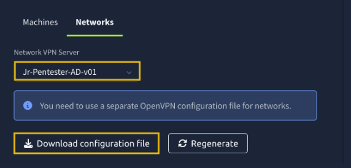

Then run the following command from the same directory where your VPN configuration file is located:

sudo openvpn [your_configuration_file_name.ovpn]

If you have issues connecting to the VPN, have a look [this help article](https://help.tryhackme.com/en/articles/6496058-troubleshooting-openvpn-on-linux-and-mac).

* Note 1: If you are a free user, you should use your own VM with the VPN profile described above.
* Note 2: If you are a premium user, it is important that you do not use the AttackBox and the VPN connection simultaneously.

**Verifying Connectivity to the Network**

You can run the route command to verify that your attacker machine can communicate with the target network. The terminal below shows an example output.

Check your route output for the 10.211.11.0 subnet. If it appears, your machine can reach the target network. You can then ping the target machines to test connectivity.

**Troubleshooting Connectivity Issues**

If the AttackBox can’t connect, open a terminal and run:

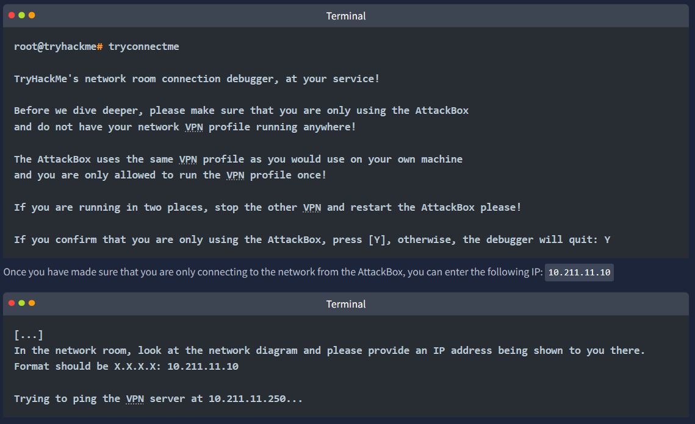

From there, follow the instructions given by the script. When the script asks for your VPN server, enter Jr-Pentester-AD-v01.

If you encounter any issues, please reach out to us on Discord or via email at support@tryhackme.com.

# **Mapping Out the Network**

We’ve been given VPN access to an AD network but no credentials. Our attacker machine has up-to-date tools. Goal: discover AD structure, hosts, services and map the network. Scope: 10.211.11.0/24.

**Host Discovery**

Start by discovering live hosts in the subnet so you know which targets to probe. We’ll show two common tools for this.

**fping**

fping sends ICMP probes to many targets quickly (it moves on after each request rather than waiting). It’s useful for scanning subnets.

Example command:

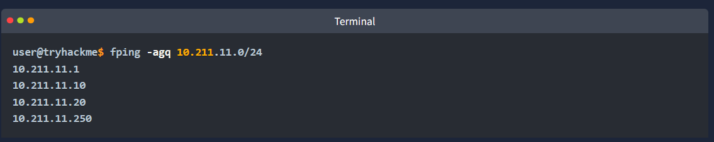

* -a: shows systems that are alive.
* -g: generates a target list from a supplied IP netmask.
* -q: quiet mode, doesn't show per-probe results or ICMP error messages.

After running this command, we identify four live hosts.10.200.12.1 is the gateway, and 10.200.12.250 is the VPN server, so we can ignore these two hosts since they are out of scope. We can conveniently add the two IPS we've discovered to a text file called "hosts.txt" for our port scans.

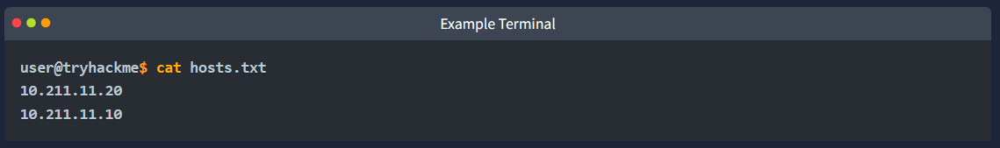

**Nmap (Ping Scan)**

Use Nmap’s ping-scan to quickly find hosts in the subnet:

nmap -sn 10.211.11.0/24

-sn = ping scan (finds hosts that are up; no port scan).

**Port Scanning**

After finding live hosts, identify the Domain Controller (DC) and which AD services/ports are running — those are high-value targets.

Common Active Directory ports/protocols (port — purpose):

* 53 (TCP/UDP) — DNS (name resolution).
* 88 (TCP/UDP) — Kerberos authentication.
* 135 (TCP) — RPC endpoint mapper (Windows RPC).
* 139 (TCP) — NetBIOS Session Service (older SMB).
* 389 (TCP/UDP) — LDAP (directory queries).
* 445 (TCP) — SMB / CIFS (file shares, named pipes).
* 464 (TCP/UDP) — Kerberos password change / service.
* 636 (TCP) — LDAPS (LDAP over TLS).
* 3268 (TCP) — Global Catalog (LDAP GC port).
* 5985 (TCP) — WinRM (HTTP).
* 5986 (TCP) — WinRM over HTTPS.
* 3389 (TCP) — RDP (remote desktop).

Service Version Scan

Run Nmap on key AD ports to identify the Domain Controller:

nmap -p 88,135,139,389,445 -sV -sC -iL hosts.txt

* -sV → Detect service versions
* -sC → Run default NSE scripts
* -iL hosts.txt → Read target hosts from file

Tip: The DC usually has ports 88 (Kerberos), 389 (LDAP), 445 (SMB) open, often showing banners like Windows Server or the domain name.

Full Port Scan (Optional)

For thorough assessments or unknown environments, scan all TCP ports:

nmap -sS -p- -T3 -iL hosts.txt -oN full_port_scan.txt

* -sS → TCP SYN scan (stealthy)
* -p- → Scan all 65,535 TCP ports
* -T3 → Normal timing (speed vs stealth)
* -iL hosts.txt → Targets from file
* -oN full_port_scan.txt → Save results to file

Summary

Found two live hosts: one DC, one workstation.
Confirmed key services running on the DC.
Ready to target these services for further AD enumeration.

What is the domain name of our target?

tryhackme.loc

What version of Windows Server is running on the DC?

Windows Server 2019 Datacenter 17763

# **Network Enumeration With SMB**

We assume we have breached the corporate network perimeter and have a Linux box (AttackBox or any preferred offensive distro over VPN).

Goal: enumerate SMB network shares, identify services, and access share contents.

**Discovering Services**

Start with Nmap to find Windows/AD-related ports. Focus on these:

* TCP 88 (Kerberos): Kerberos uses this port for authentication in the Active Directory. From a penetration testing point of view, it can be a goldmine for ticket attacks like Pass-the-Ticket and Kerberoasting.
* TCP 135 (RPC Endpoint Mapper): This TCP port is used for Remote Procedure Calls (RPC). It might be leveraged to identify services for lateral movement or remote code execution via DCOM.
* TCP 139 (NetBIOS Session Service): This port is used for file sharing in older Windows systems. It can be abused for null sessions and information gathering.
* TCP 389 (LDAP): This TCP port is used by the Lightweight Directory Access Protocol (LDAP). It is in plaintext and can be a prime target for enumerating AD objects, users, and policies.
* TCP 445 (SMB): Critical for file sharing and remote admin; abused for exploits like EternalBlue, SMB relay attacks, and credential theft.
* TCP 636 (LDAPS): This port is used by Secure LDAP. Although it is encrypted, it can still expose AD structure if misconfigured and can be abused via certificate-based attacks like AD CS exploitation.

Scan the target DC for these services, detect versions, and run default scripts:

nmap -p 88,135,139,389,445,636 -sV -sC TARGET_IP

* -sV → Service version detection
* -sC → Run default NSE scripts

The scan reveals which ports are active and the versions of the services, providing a starting point for SMB enumeration.

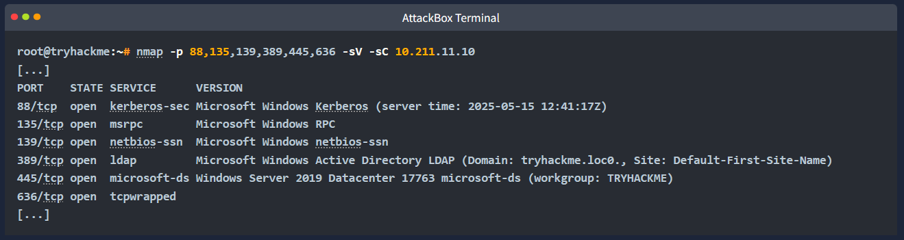

The open ports (Kerberos 88, LDAP 389, SMB 445) indicate a Windows Active Directory environment. This could be a domain controller or part of an AD domain.

**Listing SMB Shares**

We don’t have credentials yet, so we’ll check for anonymous (null session) access.
Two useful Linux tools for SMB enumeration:

* smbclient – command-line tool (part of Samba) similar to FTP. Allows listing, uploading, downloading, and browsing SMB shares.
* smbmap – provides easier mapping and permission checks across SMB shares.

List shares on the target anonymously:

smbclient -L //TARGET_IP -N

* -L → List available shares
* -N → No password (null session)

This command reveals which SMB shares are exposed and potentially accessible.

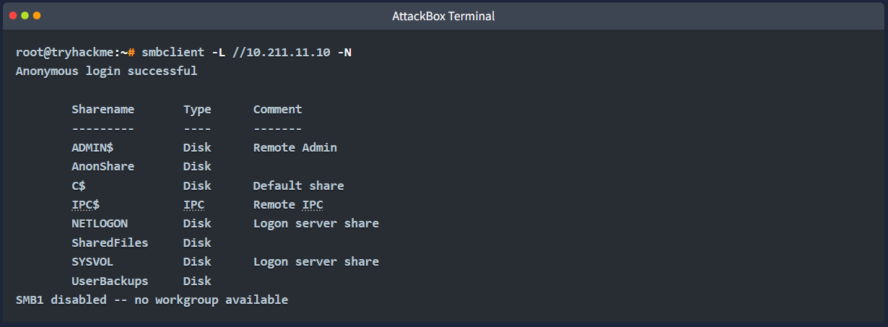

Another tool is smbmap, a reconnaissance tool that enumerates SMB shares across a host. It can be used to display read and write permissions for each share. It’s instrumental for quickly identifying accessible or misconfigured shares without manually connecting to each one. Below is an example of running smbmap -H TARGET_IP. Note that smbmap is located in /root/Desktop/Tools/Miscellaneous/smbmap on the AttackBox.

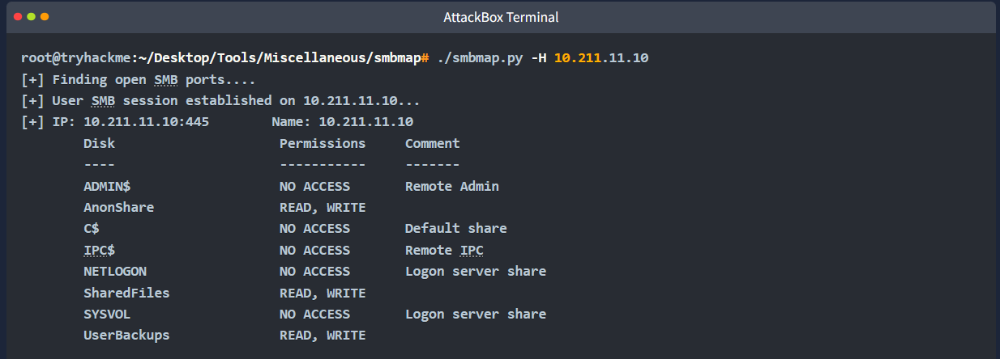

From smbclient or smbmap, three non-standard shares stand out:

* AnonShare
* SharedFiles
* UserBackups

Tip: You can also discover share permissions using Nmap:

> nmap -p445 --script smb-enum-shares 10.211.11.10

Shows which shares have READ/WRITE, READ, or no access.

**Accessing SMB Shares**

Focus on shares that allow anonymous READ access.

Using smbclient to connect and list files:

> smbclient //TARGET_IP/SHARE_NAME -N

* -N → No password (null session)

Once connected, list files:

> ls

Download a file:

> get file_name

Example:

> get Mouse_and_Malware.txt

(This downloads the file to your AttackBox for further analysis.)

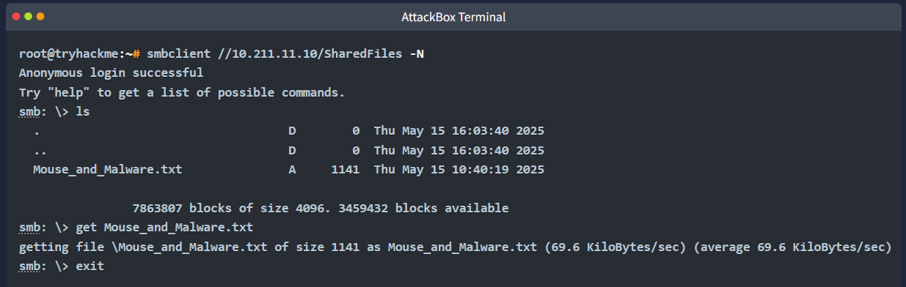

**Accessing SMB Shares with Credentials**

If you have a username/password, you can connect to an SMB share like this:

> smbclient //TARGET_IP/SHARE_NAME -U 'username%password'

> --user=USERNAME --password=PASSWORD works too

For domain accounts, include -W DOMAIN
Without credentials, use -N for anonymous (null session) access.

**What Can We Find in SMB Shares**

Anonymous SMB shares are risky but still exist for legacy systems (printers, scanners, etc.).
From a penetration tester’s perspective, SMB shares may contain:

* Config files and scripts
* Backup files
* Documents containing usernames or passwords
* Writable shares encourage file uploads, increasing the chance of discovering sensitive data. Thorough enumeration is essential.

**Other Useful Tools**

* Impacket-smbclient – Python version of smbclient (/opt/impacket/examples/)
* CrackMapExec (CME) – Enumeration, listing shares, testing credentials
* enum4linux / enum4linux-ng – Extensive SMB enumeration:

[CrackMapExec](https://www.kali.org/tools/crackmapexec/) is not only for post-exploitation but also for enumeration. It includes many SMB modules for listing shares, testing credentials, and many others.

The enum4linux or enum4linux-ng is a powerful tool that performs extensive enumeration over SMB. You can try enum4linux -a TARGET_IP to get a trove of information. It might be a good idea to redirect the output to a file so that you can go through it slowly.

Finally, as mentioned earlier in this task, we should not forget Nmap with the smb-enum-shares script.

<sumamry>What is the flag hidden in one of the shares?

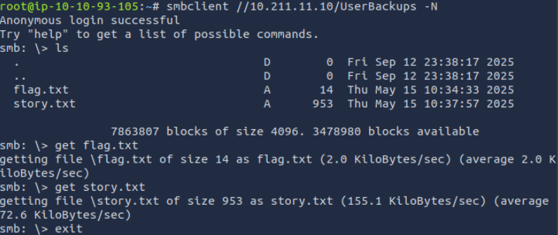
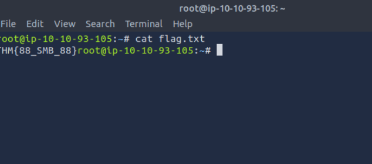
THM{88_SMB_88}

# **Domain Enumeration**

With a clearer view of the target network, the next step is enumerating users to find valid accounts and potential targets.
Usernames can be gathered via various unauthenticated methods depending on misconfigurations.

**LDAP Enumeration (Anonymous Bind)**

LDAP (Lightweight Directory Access Protocol) manages directory services like Active Directory. It organizes users, groups, devices, and other resources, which can be queried by applications and users.
Some LDAP servers allow anonymous read-only queries, potentially exposing user accounts and other directory info.
Testing Anonymous LDAP Bind

Use ldapsearch to check if anonymous access is enabled:

> ldapsearch -x -H ldap://10.211.11.10 -s base

* -x → Simple (anonymous) authentication
* -H → LDAP server URL
* -s base → Query only the base object, no subtrees

This helps determine if the LDAP server leaks information without credentials.
If it is enabled, we should see lots of data, similar to the output below:

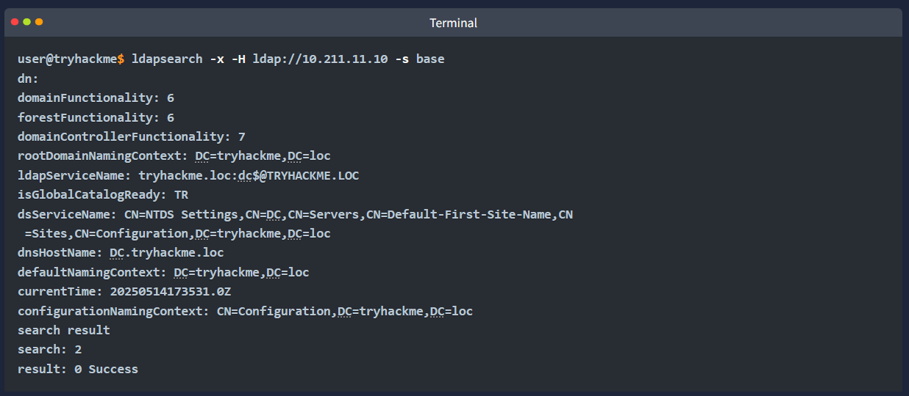

We can then query user information with this command:

> ldapsearch -x -H ldap://10.211.11.10 -b "dc=tryhackme,dc=loc" "(objectClass=person)"

**Enum4linux-ng**

Automates Windows enumeration via SMB and RPC:

> enum4linux-ng -A 10.211.11.10 -oA results.txt

* -A → All enumeration functions (users, groups, shares, password policy, RID cycling, OS info, NetBIOS info)
* -oA → Output to YAML and JSON files

**RPC Enumeration (Null Sessions)**

MSRPC allows one machine to request services from another. When SMB allows null sessions, unauthenticated users can enumerate users, groups, and shares via the IPC$ share.

Verify null session access:

> rpcclient -U "" 10.211.11.10 -N

* -U "" → Anonymous login
* -N → No password prompt

If successful, enumerate users:

> enumdomusers

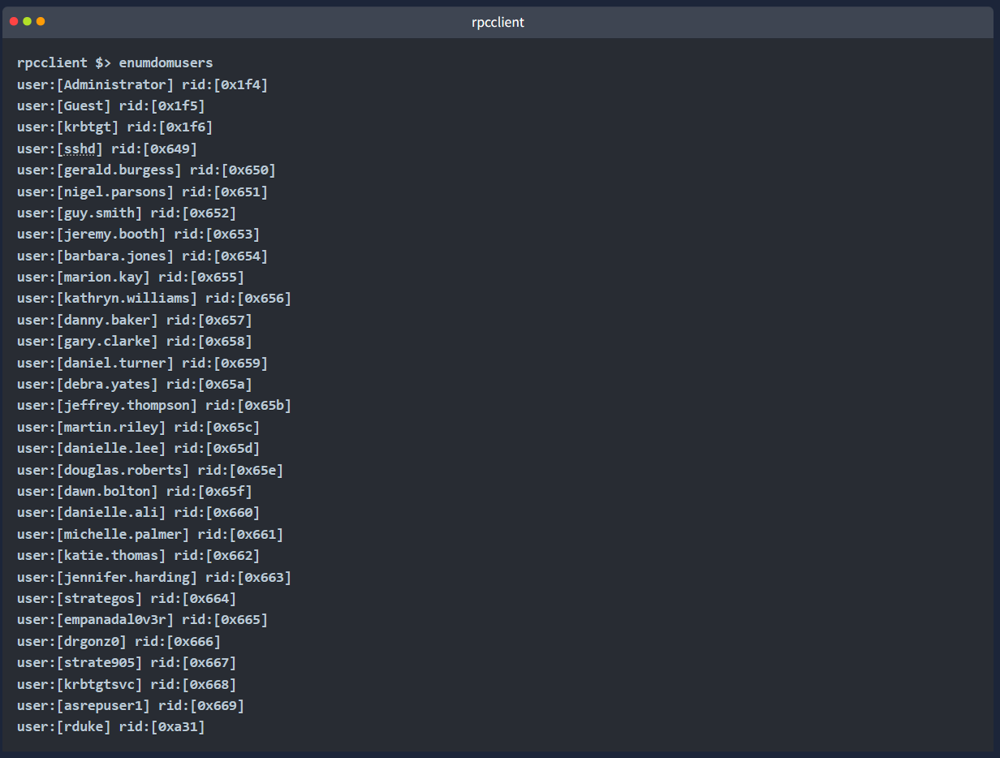

You can run help in the rpcclient shell to view the list of available commands. With the right permissions, we can enumerate the domain thoroughly through RPC.

**RID Cycling**

RIDs (Relative Identifiers) are part of a user or group’s SID in Active Directory. Well-known RIDs include:

* 500 → Administrator
* 501 → Guest
* 512-514 → Domain Admins, Domain Users, Domain Guests
* Regular user accounts usually start from 1000+

Technique:

* Use enum4linux-ng to determine the RID range
* Or try a known range (e.g., 1000-1200) and increment if results are found

Manual RID queries:

If enumdomusers is restricted, you can query individual RIDs with a bash loop (example in next step).

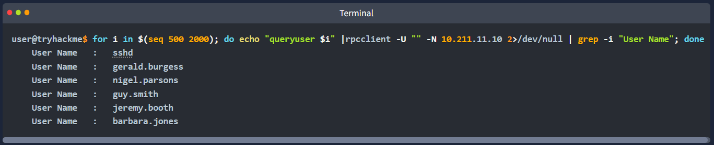

* for i in $(seq 500 2000): We first run a for loop to iterate through a range of possible RIDs to identify valid user accounts.
* echo "queryuser $i": queries information about the user associated with RID $i.
* 2>/dev/null: Redirects any error messages (standard error) to /dev/null, effectively silencing them.
* | grep -i "User Name": filters the output to display lines containing "User Name", ignoring case sensitivity (-i).
Please note that this command can take 2-3 minutes to complete.

**Username Enumeration With Kerbrute**

Kerberos is the main authentication protocol in Windows domains.

* Uses tickets via a trusted Key Distribution Center (KDC)
* Enables mutual authentication and stronger encryption than NTLM

Kerbrute

Kerbrute enumerates valid AD users by abusing Kerberos pre-authentication.

Tools like enum4linux-ng or rpcclient may return usernames that are:

* Disabled accounts
* Non-domain accounts
* Honeypot/fake users
* False positives

Running these usernames through Kerbrute confirms which accounts are real and active, providing accurate targets for password spraying.

Creating a User List

Gather usernames from previous enumeration tools to build a valid user list for attacks.

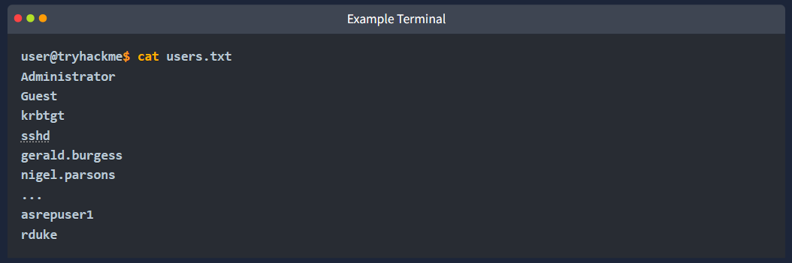

Kerbrute Installation

1.) Download a precompiled binary for your OS - [https://github.com/ropnop/kerbrute/releases](https://github.com/ropnop/kerbrute/releases).

2.) Rename kerbrute_linux_amd64 to kerbrute.

3.) Run chmod +x kerbrute to make kerbrute executable.

Please note that kerbrute is not installed on the AttackBox, and will require internet access if you wish to download and experiment with it.

Kerbrute performs brute-force username enumeration against Kerberos:

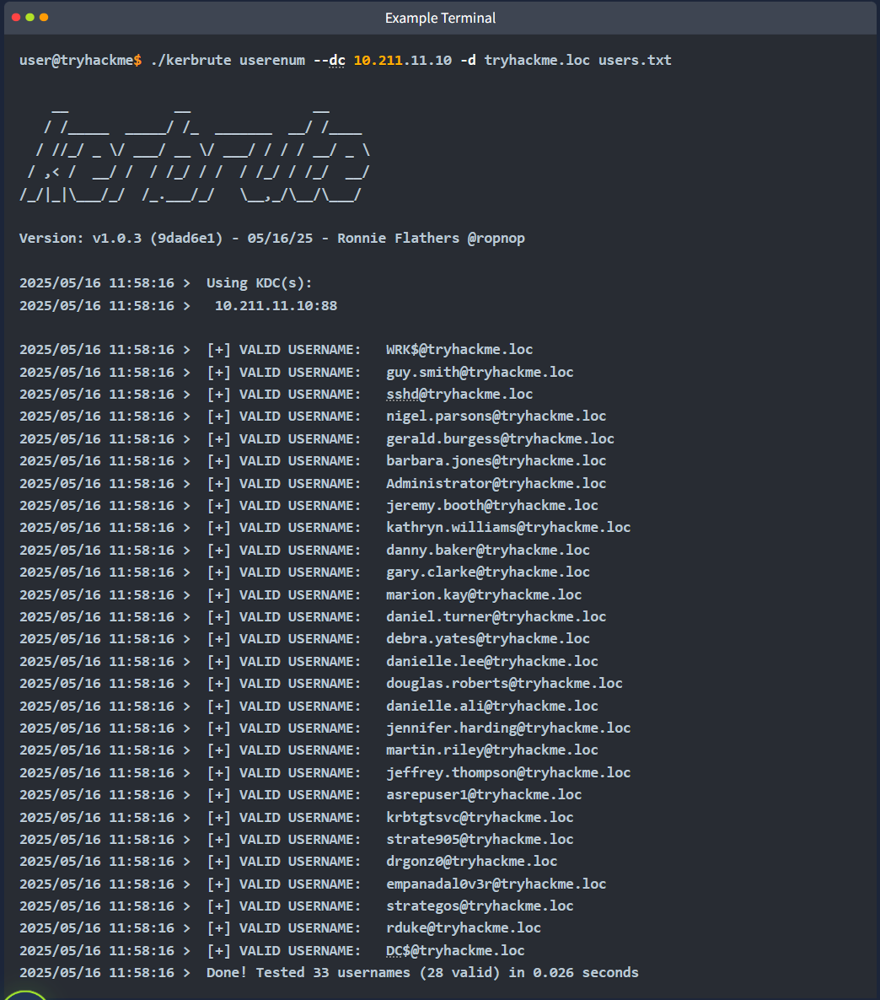

As we can see in the output above, 28 out of the 33 users from our list are valid. We can use this information to update our user list.

However, if our only choice is to use kerbrute for user enumeration because the other tools aren't working, we can download a wordlist like [this one](https://github.com/danielmiessler/SecLists/blob/master/Usernames/Names/names.txt) to discover user accounts. Once we have found a valid list of users, we can add them to a file called users.txt that we will use during our password spraying attack.

Throughout this task, we have explored multiple tools to help us with domain enumeration, such as gathering valid domain users. With a valid list, we are ready to start our password spraying attack and get our first set of AD credentials.

What group is the user rduke part of?

Domain Users

What is this user's full name?

Raoul Duke

<sumamry>Which username is associated with RID 1634?

katie.thomas

# **Password Spraying**

Password spraying tests a small set of common passwords across many accounts.

1. Avoids account lockouts by limiting attempts per account
2. Exploits weak or predictable password practices, such as:
 - Frequent password changes → predictable patterns (e.g., Summer2025!)
 - Poor policy enforcement
 - Reused passwords across accounts

Common password lists:

* Seasonal passwords
* Default IT passwords (Password123)
* Leaked passwords (e.g., rockyou.txt)

**Understanding Password Policy**

Before spraying, check the target’s password policy to learn:

* Minimum length
* Complexity requirements
* Lockout threshold

Using rpcclient

Query the DC via a null session:

> rpcclient -U "" 10.211.11.10 -N

Retrieve password policy info:

> getdompwinfo

This gives key details needed to plan a safe and effective password spraying attack.

CrackMapExec

CrackMapExec is a well-known network service exploitation tool that we will use throughout this module. It allows us to perform enumeration, command execution, and post-exploitation attacks in Windows environments. It supports various network protocols, such as SMB, LDAP, RDP, and SSH. If anonymous access is permitted, we can retrieve the password policy without credentials with the following command:

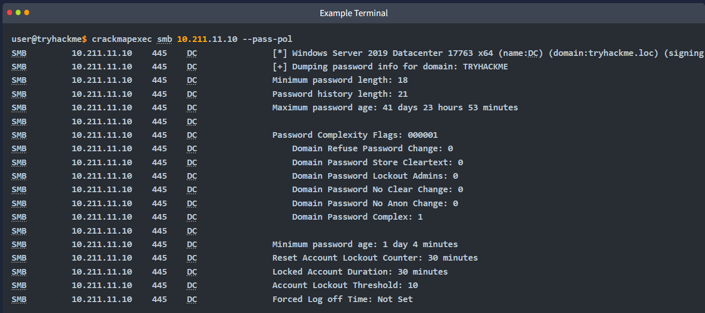

**Performing Password Spraying Attacks**

We have gathered a solid user list from our user enumeration in the previous task; we now need to create a small list of common passwords.
Through our password policy enumeration, we saw that the password complexity is equal to 1:

In rpcclient: password_properties: 0x00000001
With CrackMapExec: Password Complexity Flags: 000001
This means that at least three of the following four conditions need to be respected for a password to be created:

* Uppercase letters
* Lowercase letters
* Digits
* Special characters

Also, passwords cannot contain the user's account name or parts of their full name exceeding two consecutive characters. We can refer to this link to understand Microsoft's password complexity definitions.

Let's imagine that through some OSINT, we discovered that this company was in a data breach, and some of the known passwords were variations of the string "Password". We can create the following list, making sure to respect the password policy:

* Password!
* Password1
* Password1!
* P@ssword
* Pa55word1

We can use CrackMapExec to run our password spraying attack against the WRK computer:

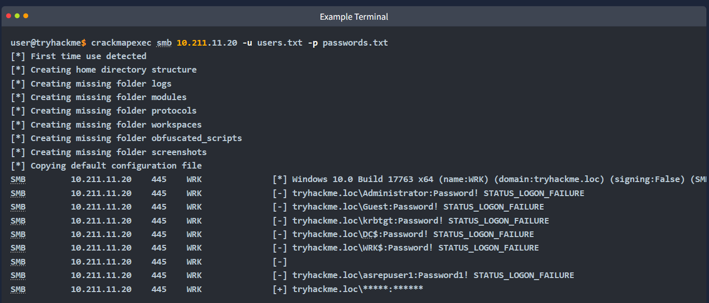

(The [+] in the last line of our output indicates that we have found a valid credential pair.)

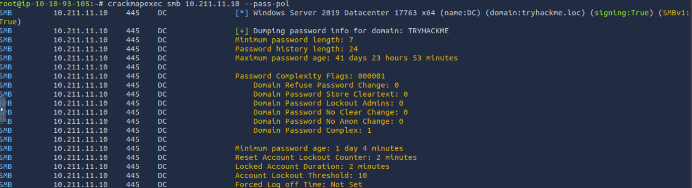

<sumamry>What is the minimum password length?

7

<sunmmary>What is the locked account duration?

2 minutes

erform password spraying using CrackMapExec. What valid credentials did you find? (format: username:password)

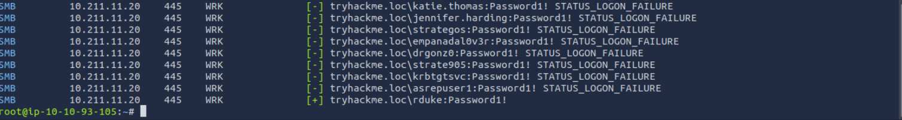
rduke:Password1!

# **Conclusion**

In this room, we focused on unauthenticated reconnaissance and enumeration:

* Mapping the network
* Enumerating SMB shares
* LDAP and RPC enumeration
* Password spraying techniques and tools

Active Directory is complex — continue building your skills with additional rooms:

* [Breaking Windows](https://tryhackme.com/module/breakingwindows)
* [Compromising Active Directory](https://tryhackme.com/module/hacking-active-directory)
* [Next room](https://tryhackme.com/room/adauthenticatedenumeration): AD: Authenticated Enumeration

It’s now time to proceed to the next room and practice authenticated [AD enumeration](https://tryhackme.com/room/adauthenticatedenumeration).

