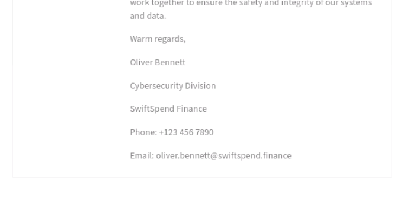
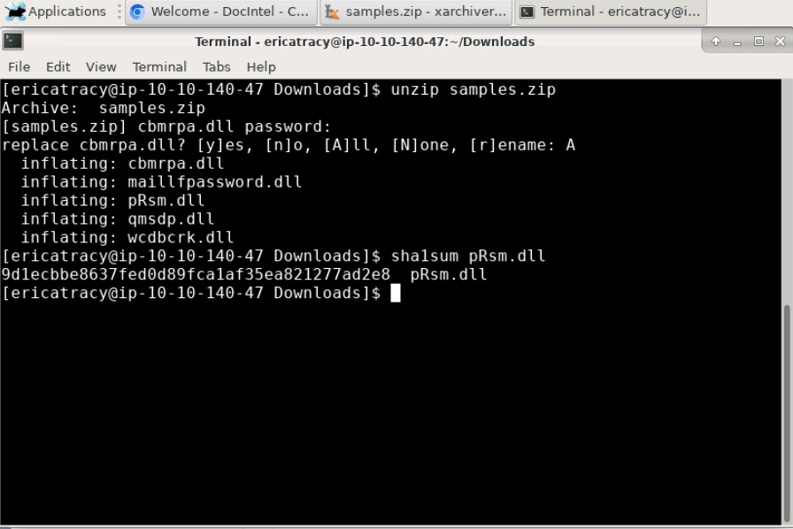
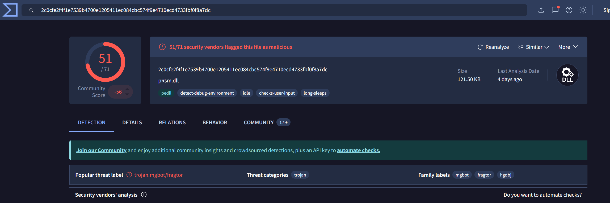
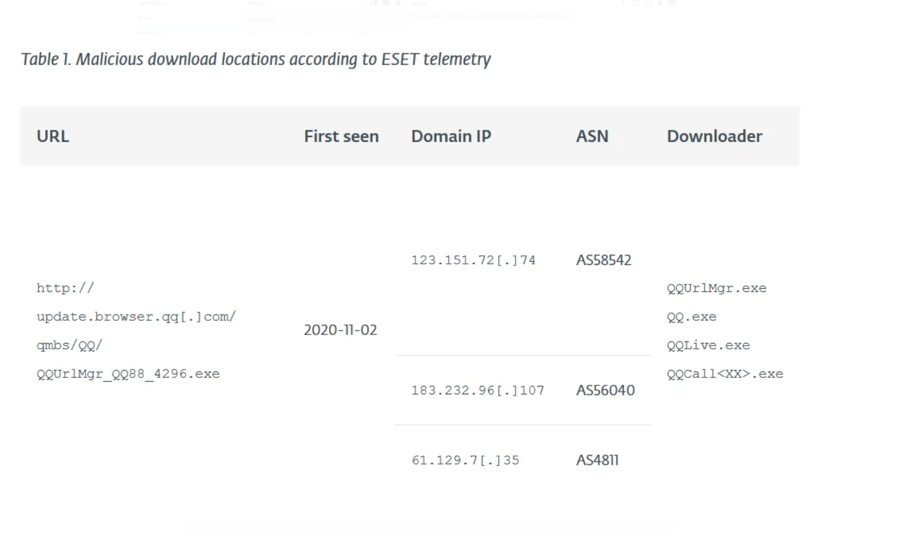
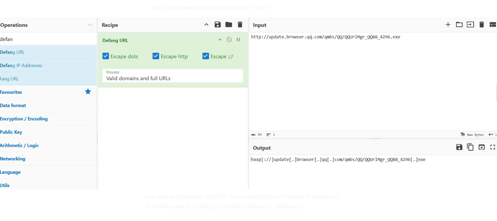
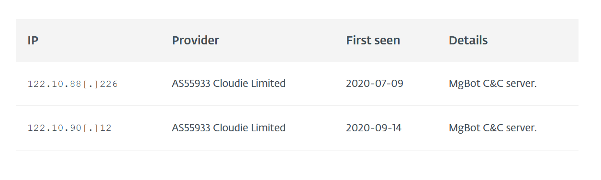
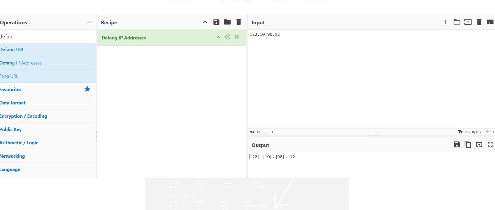
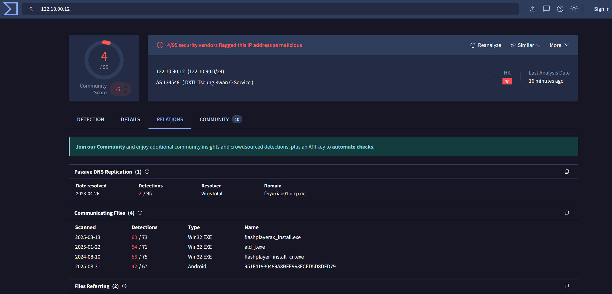

# **Challenge Scenario**

Disclaimer

Please note: The artefacts used in this scenario were retrieved from a real-world cyber-attack. Hence, it is advised that interaction with the artefacts be done only inside the attached VM, as it is an isolated environment.

**Hello Busy Weekend. . .**

It's a Friday evening at PandaProbe Intelligence when a notification appears on your CTI platform. While most are already looking forward to the weekend, you realise you must pull overtime because SwiftSpend Finance has opened a new ticket, raising concerns about potential malware threats. The finance company, known for its meticulous security measures, stumbled upon something suspicious and wanted immediate expert analysis.

As the only remaining CTI Analyst on shift at PandaProbe Intelligence, you quickly took charge of the situation, realising the gravity of a potential breach at a financial institution. The ticket contained multiple file attachments, presumed to be malware samples.

With a deep breath, a focused mind, and the longing desire to go home, you began the process of:

* Downloading the malware samples provided in the ticket, ensuring they were contained in a secure environment.
* Running the samples through preliminary automated malware analysis tools to get a quick overview.
* Deep diving into a manual analysis, understanding the malware's behaviour, and identifying its communication patterns.
* Correlating findings with global threat intelligence databases to identify known signatures or behaviours.
* Compiling a comprehensive report with mitigation and recovery steps, ensuring SwiftSpend Finance could swiftly address potential threats.

**Connecting to the machine**

Start the virtual machine in split-screen view by clicking the green Start Machine button on the upper right section of this task. If the VM is not visible, use the blue Show Split View button at the top-right of the page. Additionally, you can open the DocIntel platform using the credentials below.

Note: While the web browser (i.e., Chromium) will immediately start after boot up, it may show a tab that has a "502 Bad Gateway" error message displayed. This is because the DocIntel platform takes about 5 more minutes to finish starting up after the VM has completely booted up. After 5 minutes, you can refresh the page in order to view the login page. We appreciate your patience. The ticket details can be found by logging in to the DocIntel platform. OSINT, a web browser, and a text editor outside the VM will also help.

Who shared the malware samples?

Oliver Bennett

What is the SHA1 hash of the file "pRsm.dll" inside samples.zip?

9d1ecbbe8637fed0d89fca1af35ea821277ad2e8

Which malware framework utilizes these DLLs as add-on modules?

MgBot

Which MITRE ATT&CK Technique is linked to using pRsm.dll in this malware framework?

T1123

What is the CyberChef defanged URL of the malicious download location first seen on 2020-11-02?

hxxp[://]update[.]browser[.]qq[.]com/qmbs/QQ/QQUrlMgr_QQ88_4296[.]exe

What is the CyberChef defanged IP address of the C&C server first detected on 2020-09-14 using these modules?

122[.]10[.]90[.]12

What is the md5 hash of the spyagent family spyware hosted on the same IP targeting Android devices in Jun 2025?

951F41930489A8BFE963FCED5D8DFD79

