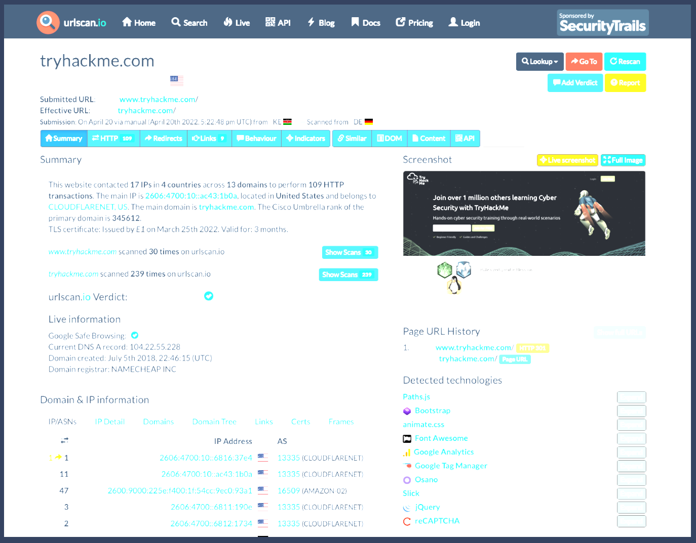
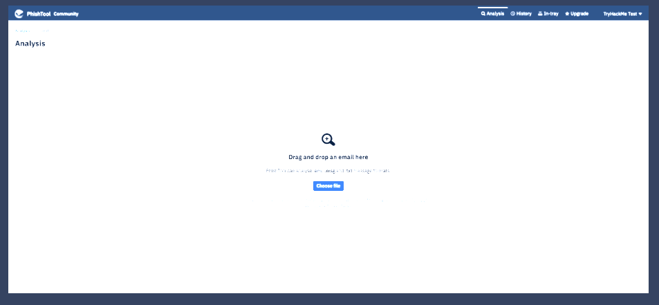
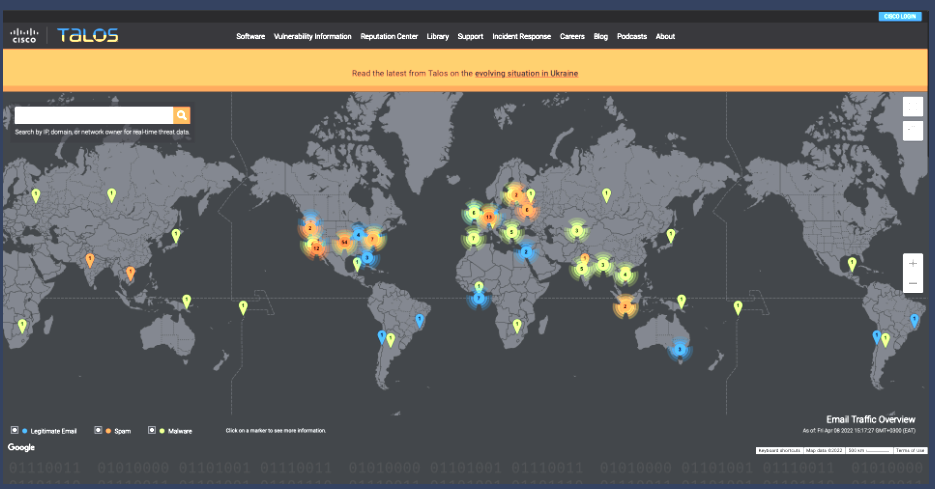
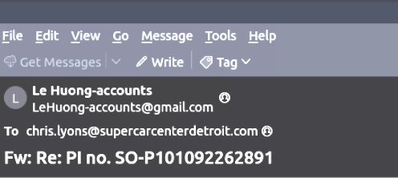
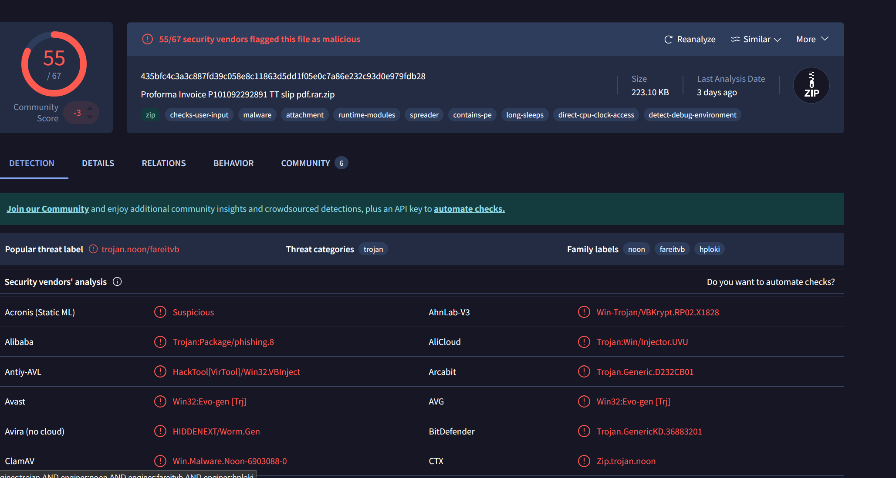
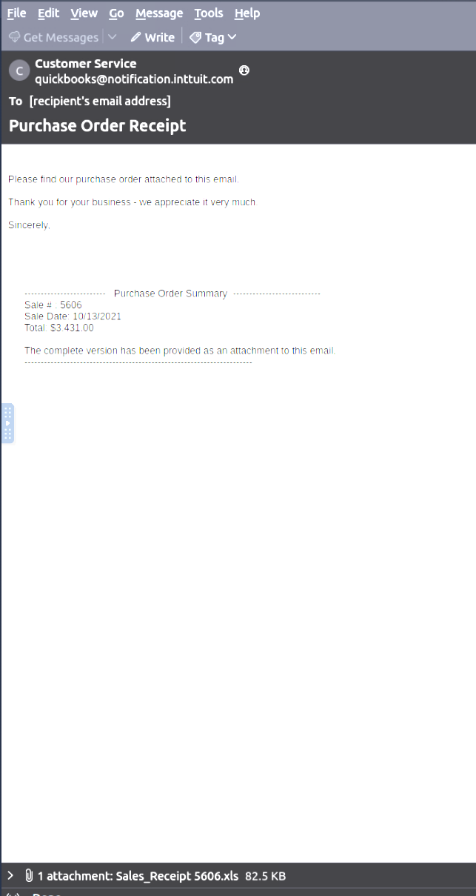
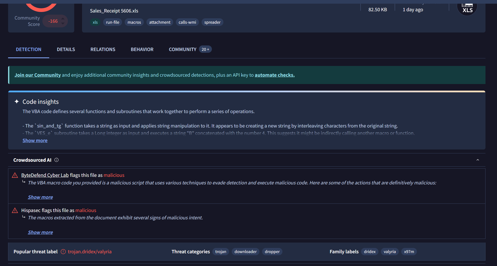

Room Outline    

This room will cover the concepts of Threat Intelligence and various open-source tools that are useful. The learning objectives include:

* Understanding the basics of threat intelligence & its classifications.
* Using UrlScan.io to scan for malicious URLs.
* Using Abuse.ch to track malware and botnet indicators.
* Investigate phishing emails using PhishTool
* Using Cisco's Talos Intelligence platform for intel gathering.

# **Threat Intelligence**

Threat Intelligence is about analysing data and information to spot patterns and understand how to defend against current or emerging threats aimed at organisations, industries, sectors, or governments.

To reduce risks, start by asking:

* Who’s attacking you?
* Why are they doing it?
* What can they do?
* What indicators of compromise should you watch for?

**Threat Intelligence Classifications**

Threat intelligence links your operational environment with your adversary. It can be broken down into:

* Strategic Intel – High-level view of the threat landscape, showing risks and trends that can shape business decisions.
* Technical Intel – Focuses on attack artefacts and evidence. Useful for Incident Response teams to map attack surfaces and build defences.
* Tactical Intel – Examines adversaries’ tactics, techniques, and procedures (TTPs). Helps strengthen controls and fix vulnerabilities during investigations.
* Operational Intel – Looks at an adversary’s motives and intent. Helps security teams identify which people, processes, or technologies are most likely to be targeted.

# **Urlscan.io**

[Urlscan.io](https://urlscan.io/) is a free service for scanning and analysing websites. It automates browsing and crawling to capture activities and interactions.

When you submit a URL, it records details such as contacted domains and IPs, requested resources, a page snapshot, used technologies, and other metadata.

The platform offers two views: recent scans and live scans in progress.

**Scan Results**

URL scan results provide ample information, with the following key areas being essential to look at:

* Summary: Provides general information about the URL, ranging from the identified IP address, domain registration details, page history and a screenshot of the site.
* HTTP: Provides information on the HTTP connections made by the scanner to the site, with details about the data fetched and the file types received.
* Redirects: Shows information on any identified HTTP and client-side redirects on the site.
* Links: Shows all the identified links outgoing from the site's homepage.
* Behaviour: Provides details of the variables and cookies found on the site. These may be useful in identifying the frameworks used in developing the site.
* Indicators: Lists all IPs, domains and hashes associated with the site. These indicators do not imply malicious activity related to the site.

(Note: Due to the dynamic nature of internet activities, data searched can produce different results on different days as new information gets updated.)

**Scenario**

You have been tasked to perform a scan on TryHackMe's domain. The results obtained are displayed in the image below. Use the details on the image to answer the questions:

What was TryHackMe's Cisco Umbrella Rank based on the screenshot?

345612

How many domains did UrlScan.io identify on the screenshot?

13

What was the main domain registrar listed on the screenshot?

NAMECHEAP INC

What was the main IP address identified for TryHackMe on the screenshot?

2606:4700:10::ac43:1b0a

# **Abuse.ch**

[Abuse.ch](https://abuse.ch/) is a research project at the Institute for Cybersecurity and Engineering, Bern University of Applied Sciences, Switzerland. It focuses on identifying and tracking malware and botnets through several platforms:

* Malware Bazaar – A database for sharing malware samples.
* Feodo Tracker – Tracks botnet command-and-control (C2) infrastructure for Emotet, Dridex, and TrickBot.
* SSL Blacklist – Provides a blocklist for malicious SSL certificates and JA3/JA3s fingerprints.
* URL Haus – Shares malware distribution sites.
* Threat Fox – Shares indicators of compromise (IOCs).

**Malware Bazaar**

Malware Bazaar is a comprehensive malware collection and analysis platform. Key features include:

* Sample Uploads – Analysts can upload malware for analysis and contribute to the intelligence database, via browser or API.
* Malware Hunting – Users can set alerts for specific tags, signatures, YARA rules, ClamAV signatures, or vendor detections to track malware.

**[Feodo Tracker](https://feodotracker.abuse.ch/)**

Feodo Tracker shares intelligence on botnet C&C servers linked to Dridex, Emotet (Heodo), TrickBot, QakBot, and BazarLoader/BazarBackdoor. It provides a searchable database of C&C servers, allowing analysts to investigate suspicious IPs. The platform also offers IP and IOC blocklists, plus mitigation guidance to help prevent botnet infections.

[SSL Blacklist](https://sslbl.abuse.ch/)

SSL Blacklist helps identify malicious SSL connections. It tracks SSL certificates used by botnet C2 servers and maintains a denylist, including JA3 fingerprints, to detect and block malware communications at the TCP layer.

Analysts can browse or download the SSL certificates and JA3 fingerprints to add to deny lists or threat-hunting rulesets.

[URLhaus](https://urlhaus.abuse.ch/)

URLhaus focuses on sharing malicious URLs used for malware distribution. Analysts can search the database for domains, URLs, hashes, and file types to support their investigations.

It also offers feeds filtered by country, AS number, or top-level domain, allowing analysts to generate targeted threat intelligence.

[ThreatFox](https://threatfox.abuse.ch/)

ThreatFox lets analysts search, share, and export malware-related indicators of compromise (IOCs). IOCs can be exported in formats like MISP events, Suricata IDS rules, domain host files, DNS RPZ, JSON, or CSV.

The IOC 212.192.246.30:5555 is identified under which malware alias name on ThreatFox?

Katana

Which malware is associated with the JA3 Fingerprint 51c64c77e60f3980eea90869b68c58a8 on SSL Blacklist?

Dridex

From the statistics page on URLHaus, what malware-hosting network has the ASN number AS14061? 

DIGITALOCEAN-ASN

Which country is the botnet IP address 178.134.47.166 associated with according to FeodoTracker?

Georgia

# **PhishTool**

**Email Phishing**

Email phishing is a common entry point for cyber attacks. Users are tricked into opening malicious files or links that appear legitimate, allowing attackers to deploy malware, steal credentials, commit fraud, or launch ransomware.

For more content on phishing, see:
* [Phishing Emails 1](https://tryhackme.com/room/phishingemails1tryoe)
* [Phishing Emails 2](https://tryhackme.com/room/phishingemails2rytmuv)
* [Phishing Emails 3](https://tryhackme.com/room/phishingemails3tryoe)
* [Phishing Emails 4](https://tryhackme.com/room/phishingemails4gkxh) 
* [Phishing Emails 5](https://tryhackme.com/room/phishingemails5fgjlzxc)

[PhishTool](https://www.phishtool.com/) helps analysts treat phishing seriously and respond effectively. It enables email analysis to uncover IOCs, prevent breaches, and generate forensic reports for containment and training.

PhishTool comes in Community and Enterprise versions. This task focuses on the Community version. You can [sign up](https://app.phishtool.com/sign-up/community) for an account to use the tool (note: access may be geo-blocked).

Core Features

* Email Analysis – Retrieves metadata and tracks actions, attachments, and URLs to triage phishing attempts.
* Heuristic Intelligence – Built-in OSINT helps understand attackers’ TTPs and anticipate persistent threats.
* Classification & Reporting – Classifies phishing emails and generates forensic reports for sharing and record-keeping.

Enterprise-Only Features

* Manage user-reported phishing events.
* Report findings back to users to keep them engaged.
* Integrate with Microsoft 365 and Google Workspace.

Interface Overview

* Analysis Tab – Upload emails for analysis in supported file formats.
* History – View all submissions and resolutions.
* In-Tray – Enterprise feature to receive and process phishing reports from team members via email integration.

Analysis Tab

After uploading an email, the Analysis Tab shows detailed information across several sections:

* Headers – Routing info such as source/destination addresses, originating IP, DNS, and timestamp.
* Received Lines – The email’s path across SMTP servers, useful for tracing.
* X-Headers – Extra fields added by the recipient mailbox with additional details.
* Security – SPF, DKIM, and DMARC policy results.
* Attachments – Lists any attached files.
* Message URLs – External links found in the email.

From here, analysts can run lookups and flag indicators as malicious. On the right-hand side, the Plaintext and Source of the email are displayed.

In the Plaintext section, we have a Resolve checkmark. Here, we get to perform the resolution of our analysis by classifying the email, setting up flagged artefacts and setting the classification codes. Once the email has been classified, the details will appear on the Resolution tab on the analysis of the email.

**Scenario**

You are a SOC Analyst and have been tasked to analyse a suspicious email, Email1.eml. To solve the task, open the email using Thunderbird on the attached VM, analyse it and answer the questions below.

What social media platform is the attacker trying to pose as in the email?

LinkedIn

What is the senders email address?

darkabutla@sc500.whpservers.com

What is the recipient's email address?

cabbagecare@hotsmail.com

What is the Originating IP address? Defang the IP address.

204[.]93[.]183[.]11

How many hops did the email go through to get to the recipient?

4

# **Cisco Talos Intelligence**

IT and cybersecurity companies collect massive amounts of data that can fuel threat intelligence. Cisco created [Talos Intelligence](https://talosintelligence.com/), a large team of security experts who turn this data into actionable intelligence, visibility on IOCs, and protection against emerging threats.

Cisco Talos is organised into six key teams:

* Threat Intelligence & Interdiction – Correlates and tracks threats, turning raw IOCs into context-rich intelligence.
* Detection Research – Analyses vulnerabilities and malware to build rules and detection content.
* Engineering & Development – Maintains and updates inspection engines to spot new threats.
* Vulnerability Research & Discovery – Works with vendors to identify and responsibly report security flaws.
* Communities – Supports Talos’ open-source projects and community presence.
* Global Outreach – Shares intelligence through reports, advisories, and publications.

For more details, see the Cisco Talos [White Paper](https://www.talosintelligence.com/docs/Talos_WhitePaper.pdf).

**Talos Dashboard**

The Talos open-source portal opens with a reputation lookup dashboard featuring a world map of email traffic. The map highlights whether emails are legitimate, spam, or malware across different countries.

Clicking a marker reveals details such as IP and hostname, daily volume, and traffic type.

At the top, we have several tabs that provide different types of intelligence resources. The primary tabs that an analyst would interact with are:

* Vulnerability Information: Disclosed and zero-day vulnerability reports marked with CVE numbers and CVSS scores. Details of the vulnerabilities reported are provided when you select a specific report, including the timeline taken to get the report published. Microsoft vulnerability advisories are also provided, with the applicable snort rules that can be used.

* Reputation Center: Provides access to searchable threat data related to IPs and files using their SHA256 hashes. Analysts would rely on these options to conduct their investigations. Additional email and spam data can be found under the Email & Spam Data tab.

**Task**

Use the information gathered from inspecting the Email1.eml file from Task 5 to answer the following questions using Cisco Talos Intelligence. Please note that the VM launched in Task 5 would not have access to the Internet.

What is the listed domain of the IP address from the previous task?

scnet.net

What is the customer name of the IP address?

Complete Web Reviews

# **Scenario 1**

Scenario: You are a SOC Analyst. Several suspicious emails have been forwarded to you from other coworkers. You must obtain details from each email to triage the incidents reported. 

Task: Use the tools and knowledge discussed throughout this room (or use your resources) to help you analyze Email2.eml found on the VM attached to Task 5 and use the information to answer the questions.

According to Email2.eml, what is the recipient's email address?

chris.lyons@supercarcenterdetroit.com

On VirusTotal, the attached file can also be identified by a Detection Alias, which starts with an H.

HIDDENEXT/Worm.Gen

# **Scenario 2**

Scenario: You are a SOC Analyst. Several suspicious emails have been forwarded to you from other coworkers. You must obtain details from each email to triage the incidents reported. 

Task: Use the tools and knowledge discussed throughout this room (or use your resources) to help you analyze Email3.eml found on the VM attached to Task 5 and use the information to answer the questions.

What is the name of the attachment on Email3.eml?

Sales_Receipt 5606.xls

What malware family is associated with the attachment on Email3.eml?

Dridex

# **Conclusion**

**There's More Out There**

You have come to the end of the room. However, this is just the tip of the iceberg for open-source threat intelligence tools that can help you as an analyst triage through incidents. There are plenty of more tools that may have more functionalities than the ones discussed in this room.

Check out these rooms to dive deeper into Threat Intelligence:

* [Yara](https://tryhackme.com/room/yara)
* [MISP](https://tryhackme.com/room/misp)
* [Red Team Threat Intel](https://tryhackme.com/room/redteamthreatintel)

