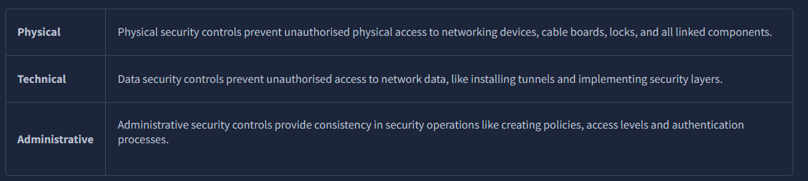
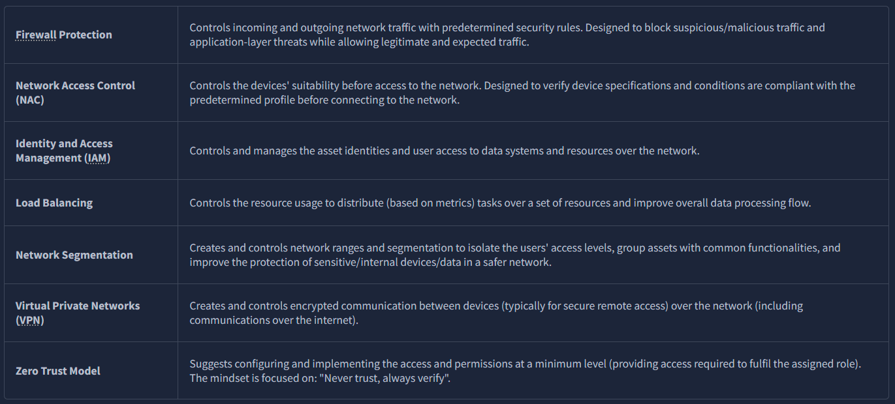
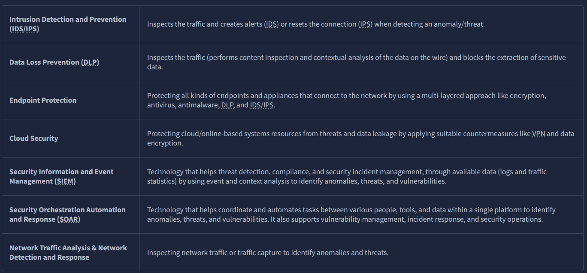
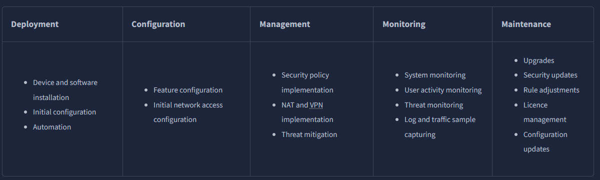
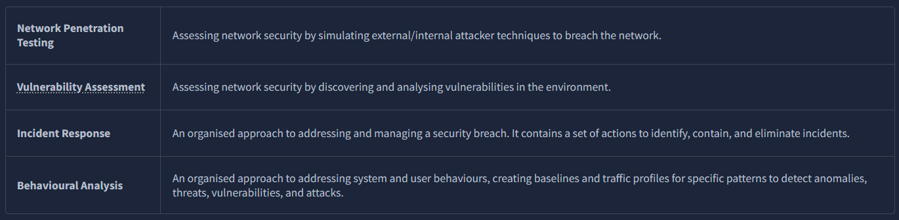
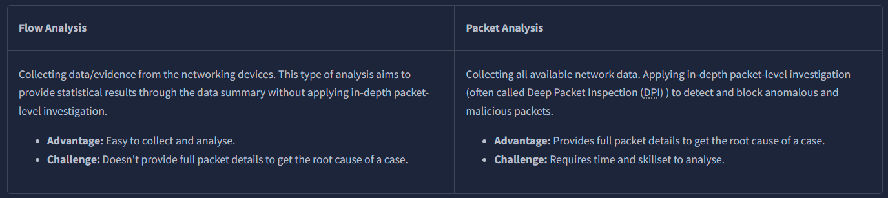
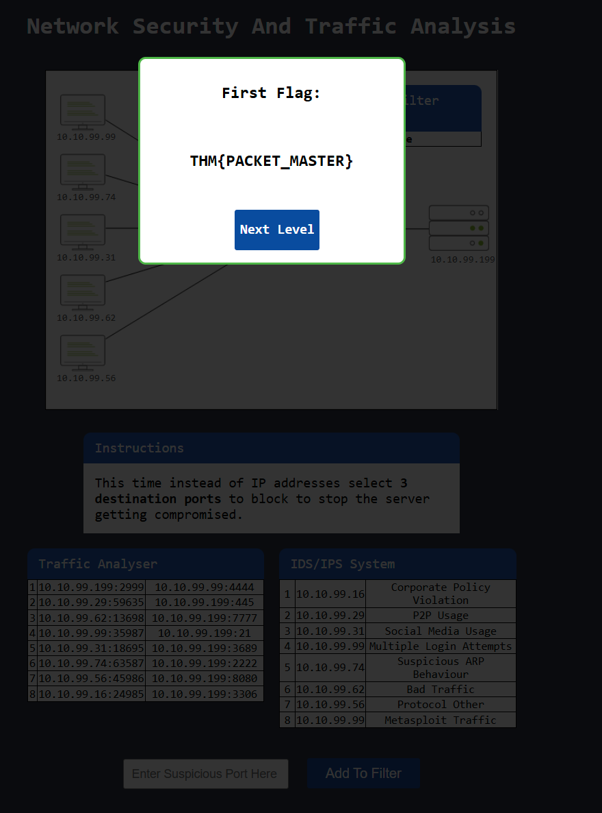
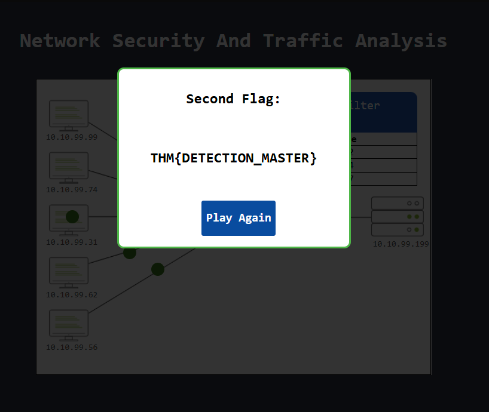

# **Introduction**

Network Security is a set of operations for protecting data, applications, devices and systems connected to the network. It is accepted as one of the significant subdomains of cyber security. It focuses on the system design, operation and management of the architecture/infrastructure to provide network accessibility, integrity, continuity and reliability. Traffic analysis (often called Network Traffic Analysis) is a subdomain of the Network Security domain, and its primary focus is investigating the network data to identify problems and anomalies.

This room will cover the foundations of Network Security and Traffic analysis and introduce the essential concepts of these disciplines to help you step into Traffic/Packet Analysis. We suggest completing the "[Network Fundamentals](https://tryhackme.com/module/network-fundamentals)" module before starting working in this room.

# **Network Security and Network Data**

**Network Security**

The essential concern of Network Security focuses on two core concepts: authentication and authorisation. There are a variety of tools, technologies, and approaches to ensure and measure implementations of these two key concepts and go beyond to provide continuity and reliability. Network security operations contain three base control levels to ensure the maximum available security management.

**Base Network Security Control Levels:**

**The key elements of Access Control:**

**The key elements of Threat Control:**

**Typical Network Security Management Operation is explained in the given table:**

**Managed Security Services**

Not every organisation has enough resources to create dedicated groups for specific security domains. There are plenty of reasons for this: budget, employee skillset, and organisation size could determine how security operations are handled. At this point, Managed Security Services (MSS) come up to fulfil the required effort to ensure/enhance security needs. MSS are services that have been outsourced to service providers. These service providers are called Managed Security Service Providers (MSSPs). Today, most MSS are time and cost effective, can be conducted in-house or outsourced, are easy to engage, and ease the management process. There are various elements of MSS, and the most common ones are explained below.

Which Security Control Level covers contain creating security policies?

Administrative

Which Access Control element works with data metrics to manage data flow?

Load Balancing

Which technology helps correlate different tool outputs and data sources?

SOAR

**# Traffic Analysis**

**Traffic Analysis / Network Traffic Analysis**

Traffic Analysis is a method of intercepting, recording/monitoring, and analysing network data and communication patterns to detect and respond to system health issues, network anomalies, and threats. The network is a rich data source, so traffic analysis is useful for security and operational matters. The operational issues cover system availability checks and measuring performance, and the security issues cover anomaly and suspicious activity detection on the network. 

Traffic analysis is one of the essential approaches used in network security, and it is part of multiple disciplines of network security operations listed below:

* Network Sniffing and Packet Analysis (Covered in [Wireshark room](https://tryhackme.com/room/wiresharkthebasics))
* Network Monitoring (Covered in [Zeek room](https://tryhackme.com/room/zeekbro))
* Intrusion Detection and Prevention (Covered in [Snort room](https://tryhackme.com/room/snort))
* Network Forensics (Covered in [NetworkMiner room](https://tryhackme.com/room/networkminer))
* Threat Hunting (Covered in [Brim room](https://tryhackme.com/room/brim))

There are two main techniques used in Traffic Analysis:

Benefits of the Traffic Analysis:

* Provides full network visibility.
* Helps comprehensive baselining for asset tracking.
* Helps to detect/respond to anomalies and threats.

**Does the Traffic Analysis Still Matter?**

The widespread usage of security tools/services and an increasing shift to cloud computing force attackers to modify their tactics and techniques to avoid detection. Network data is a pure and rich data source. Even if it is encoded/encrypted, it still provides a value by pointing to an odd, weird or unexpected pattern/situation. Therefore traffic analysis is still a must-to-have skill for any security analyst who wants to detect and respond to advanced threats.

Now you know what Traffic Analysis is and how it operates. Now use the static site to simulate a traffic analysis operation and find the flags.

**Level-1 is simulating the identification and filtering of malicious IP addresses.**

What is the flag?

Add to filter: 10.10.99.62, 10.10.99.99

THM{PACKET_MASTER}

**Level-2 is simulating the identification and filtering of malicious IP and Port addresses.**

<sumamry>What is the flag?

Add to filter: 2222, 4444, 7777

THM{DETECTION_MASTER}

# **Conclusion**

Congratulations! You just finished the "Traffic Analysis Essentials" room.

In this room, we covered the foundations of the network security and traffic analysis concepts:

* Network Security Operations
* Network Traffic Analysis

Now, you are ready to complete the "Network Security and Traffic Analysis" module.
