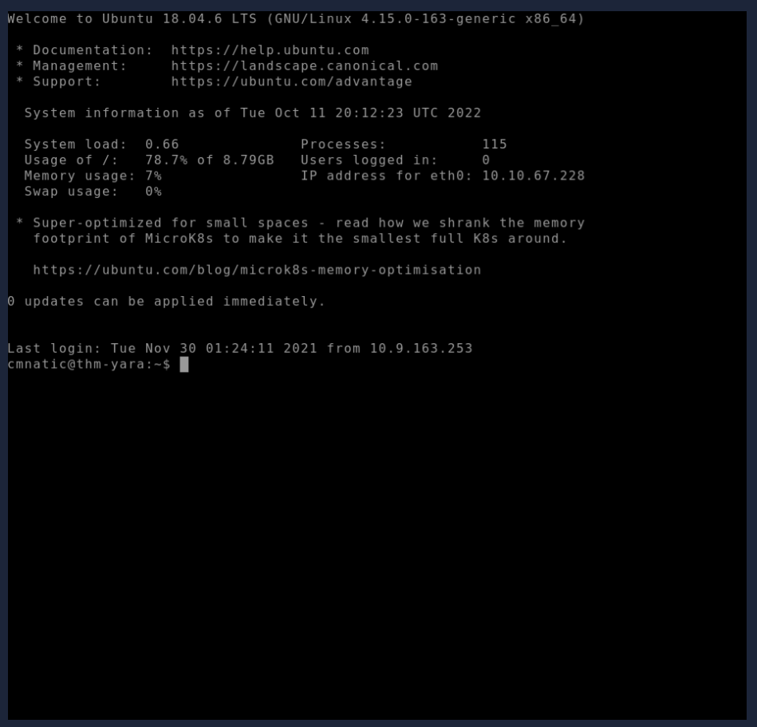
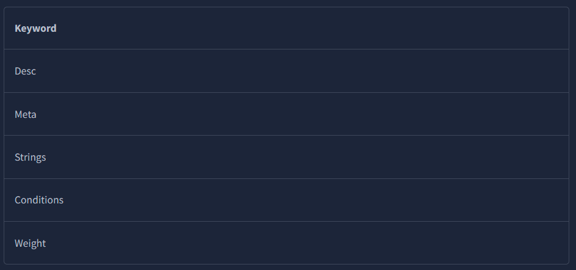
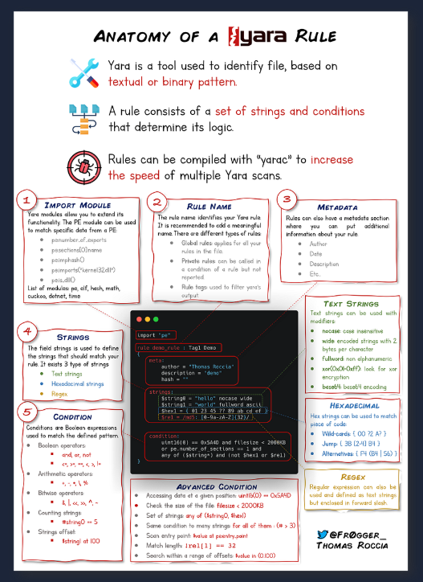
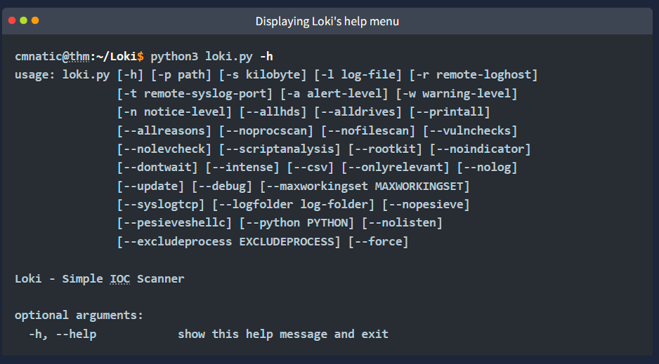
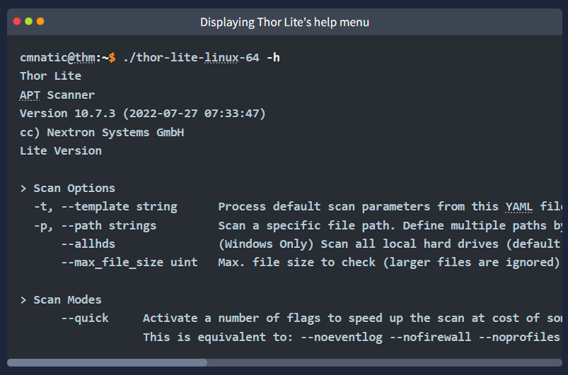
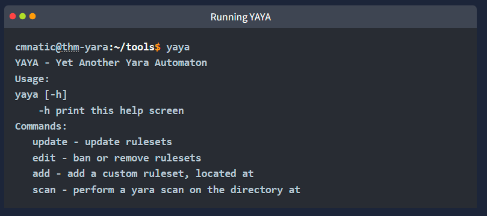
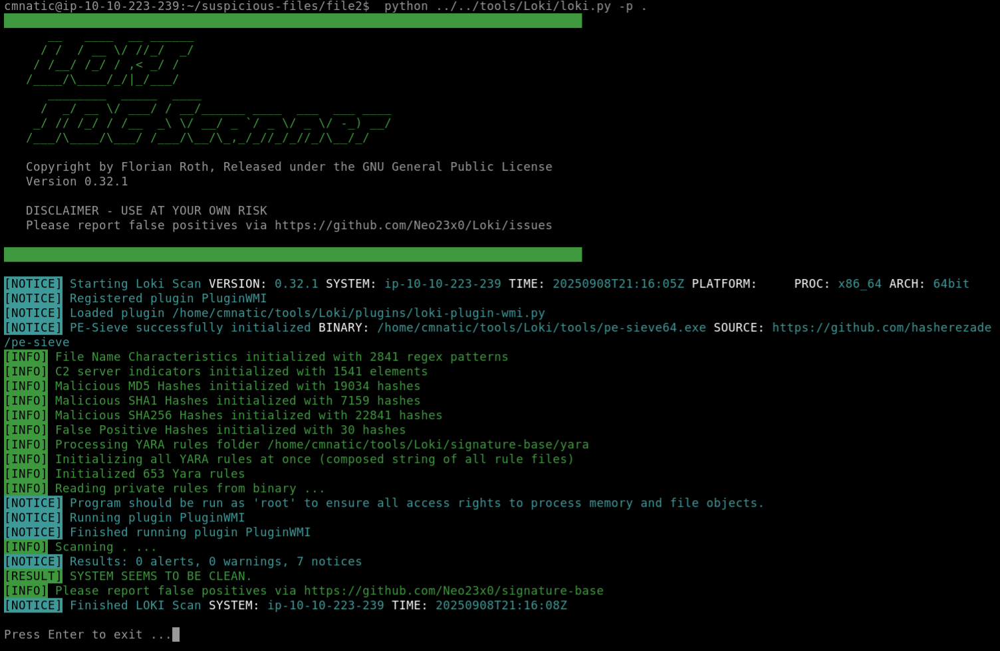
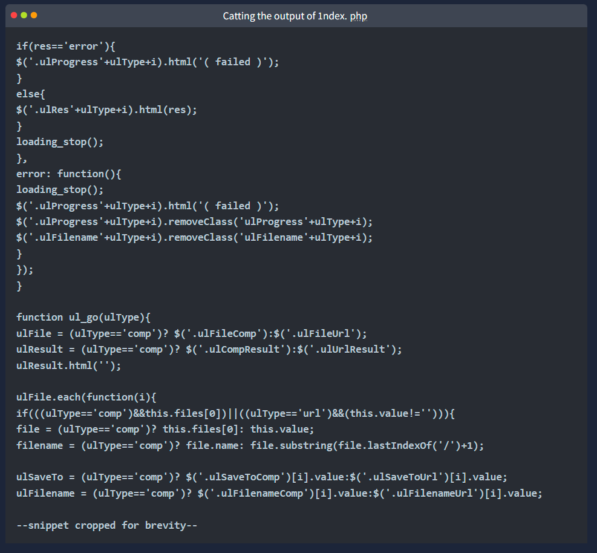
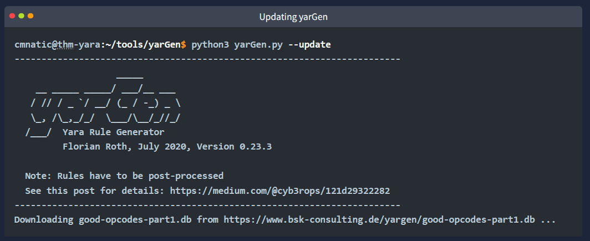
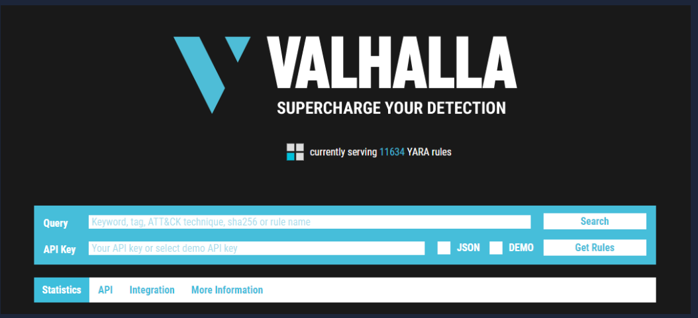

# **Introduction**

Introduction

This room will expect you to understand basic Linux familiarity, such as installing software and commands for general navigation of the system. Moreso, this room isn't designed to test your knowledge or for point-scoring. It is here to encourage you to follow along and experiment with what you have learned here.

As always, I hope you take a few things away from this room, namely, the wonder that Yara (Yet Another Ridiculous Acronym) is and its importance in infosec today. Yara was developed by Victor M. Alvarez ([@plusvic](https://twitter.com/plusvic)) and [@VirusTotal](https://twitter.com/virustotal). Check the GitHub repo [here](https://github.com/virustotal/yara).

# **What is Yara?**

**All about Yara** 

"The pattern matching swiss knife for malware researchers (and everyone else)" ([Virustotal., 2020](https://virustotal.github.io/yara/))

With such a fitting quote, Yara can identify information based on both binary and textual patterns, such as hexadecimal and strings contained within a file.

Rules are used to label these patterns. For example, Yara rules are frequently written to determine if a file is malicious or not, based upon the features - or patterns - it presents. Strings are a fundamental component of programming languages. Applications use strings to store data such as text.

For example, the code snippet below prints "Hello World" in Python. The text "Hello World" would be stored as a string.

We could write a Yara rule to search for "hello world" in every program on our operating system if we would like. 

**Why does Malware use Strings?**

Malware, just like our "Hello World" application, uses strings to store textual data. Here are a few examples of the data that various malware types store within strings:

([12t9YDPgwueZ9NyMgw519p7AA8isjr6SMw](https://www.blockchain.com/btc/address/12t9YDPgwueZ9NyMgw519p7AA8isjr6SMw))

Caveat: Malware Analysis

Explaining the functionality of malware is vastly out of scope for this room due to the sheer size of the topic. I have covered strings in much more detail in "Task 12 - Strings" of my [MAL: Introductory room](https://tryhackme.com/room/malmalintroductory). In fact, I am creating a whole Learning Path for it. If you'd like to get a taster whilst learning the fundamentals, I'd recommend my room.

**Answer the questions below**

What is the name of the base-16 numbering system that Yara can detect?

hexadecimal

Would the text "Enter your Name" be a string in an application? (Yay/Nay)

Yay

# **Deploy**

This room deploys an Instance with the tools being showcased already installed for you.  Press the "Start Machine" button and wait for an IP address to be displayed and connect in one of two ways:

**In-Browser (No  VPN required)**

Deploy your own instance by pressing the green "Start Machine" button and scroll up to the top of the room and await the timer. The machine will start in a split-screen view. In case the VM is not visible, use the blue "Show Split View" button at the top-right of the page.

**Using SSH (TryHackMe VPN required).**

You must be connected to the TryHackMe VPN if you wish to connect your deployed Instance from your own device.  If you are unfamiliar with this process, please visit the [TryHackMe OpenVPN](https://tryhackme.com/room/openvpn) room to get started. If you have any issues, please [read our support articles](https://help.tryhackme.com/).

> IP Address: 10.10.223.239
>  
> Username: cmnatic
>  
> Password: yararules!
>  
> SSH Port: 22

# **Introduction to Yara Rules**

**Your First Yara Rule**

The proprietary language that Yara uses for rules is fairly trivial to pick up, but hard to master. This is because your rule is only as effective as your understanding of the patterns you want to search for.

Using a **Yara** rule is simple. Every yara command requires two arguments to be valid, these are:
1) The rule file we create
2) Name of file, directory, or process ID to use the rule for.

Every rule must have a name and condition. For example, if we wanted to use "myrule.yar" on directory "some directory", we would use the following command:
> yara myrule.yar somedirectory

Note that .yar is the standard file extension for all Yara rules. We'll make one of the most basic rules you can make below.
1. Make a file named "somefile" via **touch somefile**
2. Create a new file and name it "myfirstrule.yar" like below:

3. Open the "myfirstrule.yar" using a text editor such as nano and input the snippet below and save the file:

The name of the rule in this snippet is **examplerule**, where we have one condition - in this case, the **condition **is condition.

As previously discussed, every rule requires both a name and a condition to be valid. This rule has satisfied those two requirements.

Simply, the rule we have made checks to see if the file/directory/PID that we specify exists via **condition: true**. If the file does exist, we are given the output of **examplerule**

Let's give this a try on the file "somefile" that we made in step one:
**yara myfirstrule.yar somefile**

If "somefile" exists, Yara will say **examplerule** because the pattern has been met - as we can see below:

If the file does not exist, Yara will output an error such as that below:

Congrats! You've made your first rule.

# **Expanding on Yara Rules**

**Yara Conditions Continued...**

Checking whether or not a file exists isn't all that helpful. After all, we can figure that out for ourselves...Using much better tools for the job.

Yara has a few conditions, which I encourage you to read [here](https://yara.readthedocs.io/en/stable/writingrules.html) at your own leisure. However, I'll detail a few below and explain their purpose.

**Meta**

This section of a Yara rule is reserved for descriptive information by the author of the rule. For example, you can use desc, short for description, to summarise what your rule checks for. Anything within this section does not influence the rule itself. Similar to commenting code, it is useful to summarise your rule.

**Strings**

Remember our discussion about strings in Task 2? Well, here we go. You can use strings to search for specific text or hexadecimal in files or programs. For example, say we wanted to search a directory for all files containing "Hello World!", we would create a rule such as below:

We define the keyword Strings where the string that we want to search, i.e., "Hello World!" is stored within the variable $hello_world

Of course, we need a condition here to make the rule valid. In this example, to make this string the condition, we need to use the variable's name. In this case, $hello_world:

Essentially, if any file has the string "Hello World!" then the rule will match. However, this is literally saying that it will only match if "Hello World!" is found and will not match if "hello world" or "HELLO WORLD."

To solve this, the condition any of them allows multiple strings to be searched for, like below:

Now, any file with the strings of:
1. Hello World!
2. hello world
3. HELLO WORLD

Will now trigger the rule.

Conditions
We have already used the true and any of them condition. Much like regular programming, you can use operators such as:

For example, the rule below would do the following:

The rule will now:
1. Look for the "Hello World!" string
2. Only say the rule matches if there are less than or equal to ten occurrences of the "Hello World!" string

Combining keywords

Moreover, you can use keywords such as:

* and
* not
* or

To combine multiple conditions. Say if you wanted to check if a file has a string and is of a certain size (in this example, the sample file we are checking is less than <10 kb and has "Hello World!" you can use a rule like below:

The rule will only match if both conditions are true. To illustrate: below, the rule we created, in this case, did not match because although the file has "Hello World!", it has a file size larger than 10KB:

However, the rule matched this time because the file has both "Hello World!" and a file size of less than 10KB.

Remembering that the text within the red box is the name of our rule, and the text within the green is the matched file.

**Anatomy of a Yara Rule**

Information security researcher "fr0gger_" has recently created a [handy cheatsheet](https://medium.com/malware-buddy/security-infographics-9c4d3bd891ef#18dd) that breaks down and visualises the elements of a YARA rule (shown above, all image credits go to him). It's a great reference point for getting started!

# **Yara Modules**

**Integrating With Other Libraries**

Frameworks such as the [Cuckoo Sandbox](https://github.com/cuckoosandbox/cuckoo) or [Python's PE Module](https://pypi.org/project/pefile/) allow you to improve the technicality of your Yara rules ten-fold.

**Cuckoo**

Cuckoo Sandbox is an automated malware analysis environment. This module allows you to generate Yara rules based upon the behaviours discovered from Cuckoo Sandbox. As this environment executes malware, you can create rules on specific behaviours such as runtime strings and the like.

**Python PE**

Python's PE module allows you to create Yara rules from the various sections and elements of the Windows Portable Executable (PE) structure.

Explaining this structure is out of scope as it is covered in my [malware introductory room](https://tryhackme.com/room/malmalintroductory). However, this structure is the standard formatting of all executables and DLL files on windows. Including the programming libraries that are used. 

Examining a PE file's contents is an essential technique in malware analysis; this is because behaviours such as cryptography or worming can be largely identified without reverse engineering or execution of the sample.

# **Other tools and Yara**

**Yara Tools**

Knowing how to create custom Yara rules is useful, but luckily you don't have to create many rules from scratch to begin using Yara to search for evil. There are plenty of GitHub [resources](https://github.com/InQuest/awesome-yara) and open-source tools (along with commercial products) that can be utilized to leverage Yara in hunt operations and/or incident response engagements. 

**LOKI (What, not who, is Loki?)**

LOKI is a free open-source IOC (Indicator of Compromise) scanner created/written by Florian Roth.

Based on the GitHub page, detection is based on 4 methods:

1. File Name IOC Check
2. Yara Rule Check (we are here)
3. Hash Check
4. C2 Back Connect Check

There are additional checks that LOKI can be used for. For a full rundown, please reference the [GitHub readme](https://github.com/Neo23x0/Loki/blob/master/README.md).

LOKI can be used on both Windows and Linux systems and can be downloaded [here](https://github.com/Neo23x0/Loki/releases).

Please note that you are not expected to use this tool in this room.

**THOR (superhero named programs for a superhero blue teamer)**

THOR Lite is Florian's newest multi-platform IOC AND YARA scanner. There are precompiled versions for Windows, Linux, and macOS. A nice feature with THOR Lite is its scan throttling to limit exhausting CPU resources. For more information and/or to download the binary, start [here](https://www.nextron-systems.com/thor-lite/). You need to subscribe to their mailing list to obtain a copy of the binary. Note that THOR is geared towards corporate customers. THOR Lite is the free version.

Please note that you are not expected to use this tool in this room.

**FENRIR (naming convention still mythical themed)**

This is the 3rd [tool](https://github.com/Neo23x0/Fenrir) created by Neo23x0 (Florian Roth). You guessed it; the previous 2 are named above. The updated version was created to address the issue from its predecessors, where requirements must be met for them to function. Fenrir is a bash script; it will run on any system capable of running bash (nowadays even Windows). 

Please note that you are not expected to use this tool in this room.

**YAYA (Yet Another Yara Automaton)**

YAYA was created by the [EFF](https://www.eff.org/deeplinks/2020/09/introducing-yaya-new-threat-hunting-tool-eff-threat-lab) (Electronic Frontier Foundation) and released in September 2020. Based on their website, "YAYA is a new open-source tool to help researchers manage multiple YARA rule repositories. YAYA starts by importing a set of high-quality YARA rules and then lets researchers add their own rules, disable specific rulesets, and run scans of files."

Note: Currently, YAYA will only run on Linux systems. 

In the next section, we will examine [LOKI](https://github.com/Neo23x0/Loki) further...

# **Using LOKI and its Yara rule set**

**Using LOKI**

As a security analyst, you may need to research various threat intelligence reports, blog postings, etc. and gather information on the latest tactics and techniques used in the wild, past or present. Typically in these readings, IOCs (hashes, IP addresses, domain names, etc.) will be shared so rules can be created to detect these threats in your environment, along with Yara rules. On the flip side, you might find yourself in a situation where you've encountered something unknown, that your security stack of tools can't/didn't detect. Using tools such as Loki, you will need to add your own rules based on your threat intelligence gathers or findings from an incident response engagement (forensics). 

As mentioned before, Loki already has a set of Yara rules that we can benefit from and start scanning for evil on the endpoint straightaway.

Loki is located in the tools.

Navigate to the Loki directory. Run python loki.py -h to see what options are available. 

If you are running Loki on your own system, the first command you should run is --update. This will add the signature-base directory, which Loki uses to scan for known evil. This command was already executed within the attached VM. 

Navigate to the yara directory. Feel free to inspect the different Yara files used by Loki to get an idea of what these rules will hunt for.

To run Loki, you can use the following command (note that I am calling Loki from within the file 1 directory)

Scenario: You are the security analyst for a mid-size law firm. A co-worker discovered suspicious files on a web server within your organization. These files were discovered while performing updates to the corporate website. The files have been copied to your machine for analysis. The files are located in the suspicious-files directory. Use Loki to answer the questions below.

Scan file 1. Does Loki detect this file as suspicious/malicious or benign?

Suspicious

What Yara rule did it match on?

webshell_metaslsoft

What does Loki classify this file as?

Web Shell

Based on the output, what string within the Yara rule did it match on?

Str1

What is the name and version of this hack tool?

b374k 2.2

Inspect the actual Yara file that flagged file 1. Within this rule, how many strings are there to flag this file?

1

Scan file 2. Does Loki detect this file as suspicious/malicious or benign?

benign

Inspect file 2. What is the name and version of this web shell?

b374k 3.2.3

# **Creating Yara rules with yarGen**

**Creating Yara rules with yarGen**

From the previous section, we realized that we have a file that Loki didn't flag on. At this point, we are unable to run Loki on other web servers because if file 2 exists in any of the webs servers, it will go undetected.

We need to create a Yara rule to detect this specific web shell in our environment. Typically this is what is done in the case of an incident, which is an event that affects/impacts the organization in a negative fashion.

We can manually open the file and attempt to sift through lines upon lines of code to find possible strings that can be used in our newly created Yara rule.

Let's check how many lines this particular file has. You can run the following: strings <file name> | wc -l.

If you try to go through each string, line by line manually, you should quickly realize that this can be a daunting task.

Luckily, we can use [yarGen](https://github.com/Neo23x0/yarGen) (yes, another tool created by Florian Roth) to aid us with this task.

What is yarGen? yarGen is a generator for YARA rules.

From the README - "The main principle is the creation of yara rules from strings found in malware files while removing all strings that also appear in goodware files. Therefore yarGen includes a big goodware strings and opcode database as ZIP archives that have to be extracted before the first use."

Navigate to the yarGen directory, which is within tools. If you are running yarGen on your own system, you need to update it first by running the following command: python3 yarGen.py --update. Please note that you cannot update on the VM attached to this room as the VM doesn't have Internet connectivity.

 
This will update the good-opcodes and good-strings DB's from the online repository. This update will take a few minutes. 

Once it has been updated successfully, you'll see the following message at the end of the output.

To use yarGen to generate a Yara rule for file 2, you can run the following command:

python3 yarGen.py -m /home/cmnatic/suspicious-files/file2 --excludegood -o /home/cmnatic/suspicious-files/file2.yar 

A brief explanation of the parameters above:

* -m is the path to the files you want to generate rules for
* --excludegood force to exclude all goodware strings (these are strings found in legitimate software and can increase false positives)
* -o location & name you want to output the Yara rule

If all is well, you should see the following output.

Generally, you would examine the Yara rule and remove any strings that you feel might generate false positives. For this exercise, we will leave the generated Yara rule as is and test to see if Yara will flag file 2 or no. 

Note: Another tool created to assist with this is called [yarAnalyzer](https://github.com/Neo23x0/yarAnalyzer/) (you guessed it - created by Florian Roth). We will not examine that tool in this room, but you should read up on it, especially if you decide to start creating your own Yara rules. 

Further Reading on creating Yara rules and using yarGen:

* h[ttps://www.bsk-consulting.de/2015/02/16/write-simple-sound-yara-rules/](https://www.bsk-consulting.de/2015/02/16/write-simple-sound-yara-rules/)
* [https://www.bsk-consulting.de/2015/10/17/how-to-write-simple-but-sound-yara-rules-part-2/](https://www.bsk-consulting.de/2015/10/17/how-to-write-simple-but-sound-yara-rules-part-2/)
* [https://www.bsk-consulting.de/2016/04/15/how-to-write-simple-but-sound-yara-rules-part-3/](https://www.bsk-consulting.de/2016/04/15/how-to-write-simple-but-sound-yara-rules-part-3/)

From within the root of the suspicious files directory, what command would you run to test Yara and your Yara rule against file 2?

yara file2.yar file2/1ndex.php

<sumamry>Did Yara rule flag file 2? (Yay/Nay)

Yay

Test the Yara rule with Loki, does it flag file 2? (Yay/Nay)

Yay

What is the name of the variable for the string that it matched on?

Zepto

Inspect the Yara rule, how many strings were generated?

20

One of the conditions to match on the Yara rule specifies file size. The file has to be less than what amount?

700kb

# **Valhalla**

Valhalla is an online Yara feed created and hosted by [Nextron-Systems](https://www.nextron-systems.com/valhalla/) (erm, Florian Roth). By now, you should be aware of the ridiculous amount of time and energy Florian has dedicated to creating these tools for the community. Maybe we should have just called this the Florian Roth room. (lol)

Per the website, "Valhalla boosts your detection capabilities with the power of thousands of hand-crafted high-quality YARA rules."

From the image above, we should denote that we can conduct searches based on a keyword, tag, ATT&CK technique, sha256, or rule name. 

Note: For more information on ATT&CK, please visit the [MITRE](https://tryhackme.com/room/mitre) room. 

Taking a look at the data provided to us, let's examine the rule in the screenshot below:

We are provided with the name of the rule, a brief description, a reference link for more information about the rule, along with the rule date. 

Feel free to look at some rules to become familiar with the usefulness of Valhalla. The best way to learn the product is by just jumping right in. 

Picking up from our scenario, at this point, you know that the 2 files are related. Even though Loki classified the files are suspicious, you know in your gut that they are malicious. Hence the reason you created a Yara rule using yarGen to detect it on other web servers. But let's further pretend that you are not code-savvy (FYI - not all security professionals know how to code/script or read it). You need to conduct further research regarding these files to receive approval to eradicate these files from the network. 

Time to use Valhalla for some threat intelligence gathering...

Enter the SHA256 hash of file 1 into Valhalla. Is this file attributed to an APT group? (Yay/Nay)

Yay

Do the same for file 2. What is the name of the first Yara rule to detect file 2?

Webshell_b374k_rule1

<sumamry>Examine the information for file 2 from Virus Total (VT). The Yara Signature Match is from what scanner?

THOR APT Scanner

Enter the SHA256 hash of file 2 into Virus Total. Did every AV detect this as malicious? (Yay/Nay)

Nay

Besides .PHP, what other extension is recorded for this file?

EXE

What JavaScript library is used by file 2?

Zepto

Is this Yara rule in the default Yara file Loki uses to detect these type of hack tools? (Yay/Nay)

Nay

# **Conclusion**

In this room, we explored Yara, how to use Yara, and manually created basic Yara rules. We also explored various open-source tools to hit the ground running that utilizes Yara rules to detect evil on endpoints.

By going through the room scenario, you should understand the need (as a blue teamer) to know how to create Yara rules effectively if we rely on such tools. Commercial products, even though not perfect, will have a much richer Yara ruleset than an open-source product. Both commercial and open-source will allow you to add Yara rules to expand its capabilities further to detect threats. 

If it is not clear, the reason why file 2 was not detected is that the Yara rule was not in the Yara file used by Loki to detect the hack tool (web shell) even though its the hack tool has been around for years and has even been attributed to at least 1 nation-state. The Yara rule is present in the commercial variant of Loki, which is Thor. 

There is more that can be done with Yara and Yara rules. We encourage you to explore this tool further at your own leisure. 

